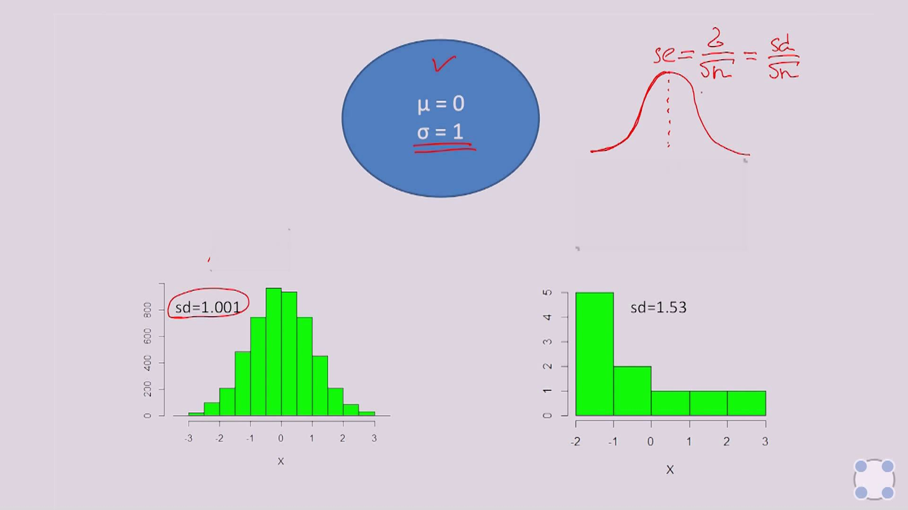
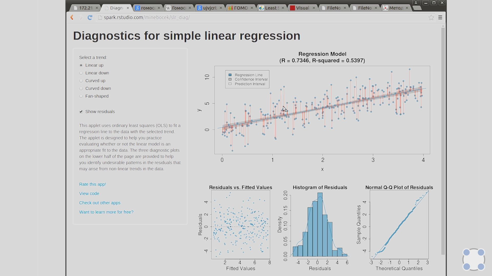

Конспект курса [Основы статистики](https://stepik.org/course/76)

Автор лекций: Анатолий Карпов.

Конспектировал @mariohuq.

_Использованные материалы_:

-   [Конспект от пользователя Михаил Курочкин](https://github.com/KlukvaMors/basic_stat) 
-   [Конспект от пользователя Фёкла Борщова](https://github.com/FyoklaBorschova/math_stat/)
-   [Конспект от пользователя Розимадлен Акопян](https://drive.google.com/file/d/1ZtxirAY5gVGnJwxrwlVs5Blp8pvEbnCH)
-   [Конспект от пользователя Vadim Dyachkov](https://docs.google.com/document/d/1d65yVxXWKK4ct-ircA_VfuQ9MbQOzs6Ezr6JQp7Gb4I)

__Содержание__

<!-- MarkdownTOC autolink="true" levels="1,2,3" style="ordered" lowercase="false" uri_encoding="false" -->

1. [Введение](#Введение)
    1. [*️ Ссылки](#*️-Ссылки)
    1. [Генеральная совокупность и выборка](#Генеральная-совокупность-и-выборка)
        1. [Понятие генеральной совокупности и выборки, репрезентативность выборки](#Понятие-генеральной-совокупности-и-выборки,-репрезентативность-выборки)
        1. [Простая случайная выборка](#Простая-случайная-выборка)
        1. [Стратифицированная выборка](#Стратифицированная-выборка)
        1. [Групповая выборка](#Групповая-выборка)
    1. [Типы переменных. Количественные и номинативные переменные](#Типы-переменных.-Количественные-и-номинативные-переменные)
        1. [Типы переменных](#Типы-переменных)
        1. [Количественные переменные](#Количественные-переменные)
        1. [Номинативные переменные](#Номинативные-переменные)
        1. [Ранговые переменные](#Ранговые-переменные)
    1. [Меры центральной тенденции](#Меры-центральной-тенденции)
        1. [Понятие описательной статистики](#Понятие-описательной-статистики)
        1. [*️ Глоссарий](#*️-Глоссарий)
        1. [Мода](#Мода)
        1. [Медиана](#Медиана)
        1. [Среднее значение](#Среднее-значение)
        1. [*️ Примеры в Pandas](#*️-Примеры-в-Pandas)
        1. [Выбор меры центральной тенденции](#Выбор-меры-центральной-тенденции)
        1. [Свойства среднего](#Свойства-среднего)
    1. [Меры изменчивости](#Меры-изменчивости)
        1. [Понятие меры изменчивости данных](#Понятие-меры-изменчивости-данных)
        1. [Размах](#Размах)
        1. [Дисперсия, стандартное отклонение](#Дисперсия,-стандартное-отклонение)
        1. [Свойства дисперсии и стандартного отклонения](#Свойства-дисперсии-и-стандартного-отклонения)
    1. [Квартили распределения и график box-plot](#Квартили-распределения-и-график-box-plot)
        1. [Квантили распределения](#Квантили-распределения)
        1. [Квартили](#Квартили)
        1. [Box plot](#Box-plot)
    1. [Нормальное распределение](#Нормальное-распределение)
        1. [Понятие нормального распределения](#Понятие-нормального-распределения)
        1. [Стандартизация](#Стандартизация)
        1. [Правила двух и трех сигм, использование стандартизации](#Правила-двух-и-трех-сигм,-использование-стандартизации)
        1. [*️ Примеры на Python](#*️-Примеры-на-Python)
    1. [Центральная предельная теорема](#Центральная-предельная-теорема)
        1. [Важное замечание о ЦПТ номер 1.](#Важное-замечание-о-ЦПТ-номер-1.)
        1. [Важное замечание о ЦПТ номер 2.](#Важное-замечание-о-ЦПТ-номер-2.)
    1. [Доверительные интервалы для среднего](#Доверительные-интервалы-для-среднего)
    1. [Идея статистического вывода, p-уровень значимости](#Идея-статистического-вывода,-p-уровень-значимости)
        1. [Статистическая проверка гипотез](#Статистическая-проверка-гипотез)
        1. [Идея статистического вывода](#Идея-статистического-вывода)
        1. [$p$-уровень значимости и его интерпретация](#$p$-уровень-значимости-и-его-интерпретация)
1. [Сравнение средних](#Сравнение-средних)
    1. [T-распределение](#T-распределение)
        1. [Нормальное распределение и ограниченность количества наблюдений](#Нормальное-распределение-и-ограниченность-количества-наблюдений)
        1. [Распределение Стьюдента \(t-распределение\)](#Распределение-Стьюдента-(t-распределение))
        1. [Понятие числа степеней свободы](#Понятие-числа-степеней-свободы)
        1. [*️ Пример](#*️-Пример)
        1. [Очень важный шаг](#Очень-важный-шаг)
        1. [Продолжение примера](#Продолжение-примера)
    1. [Сравнение двух средних; t-критерий Стьюдента](#Сравнение-двух-средних;-t-критерий-Стьюдента)
        1. [t-критерий Стьюдента](#t-критерий-Стьюдента)
        1. [Пример применения t-критерия \(денатурация ДНК\)](#Пример-применения-t-критерия-(денатурация-ДНК))
        1. [Построение графиков](#Построение-графиков)
        1. [*️ Примеры применения t-критерий Стьюдента](#*️-Примеры-применения-t-критерий-Стьюдента)
        1. [*️ Примеры на Python](#*️-Примеры-на-Python-1)
        1. [*️ Применимость критерия t-Стьюдента](#*️-Применимость-критерия-t-Стьюдента)
    1. [Проверка распределения на нормальность, QQ-Plot](#Проверка-распределения-на-нормальность,-QQ-Plot)
        1. [Сравнение распределения с нормальным](#Сравнение-распределения-с-нормальным)
        1. [QQ-Plot](#QQ-Plot)
        1. [Тест Шапиро-Вилка](#Тест-Шапиро-Вилка)
        1. [Проблема выбросов](#Проблема-выбросов)
        1. [U-критерий Манна-Уитни](#U-критерий-Манна-Уитни)
    1. [Однофакторный дисперсионный анализ](#Однофакторный-дисперсионный-анализ)
        1. [Расчет на практическом примере](#Расчет-на-практическом-примере)
        1. [F-значение](#F-значение)
        1. [Немного об обозначениях в дисперсионном анализе.](#Немного-об-обозначениях-в-дисперсионном-анализе.)
        1. [Применение и интерпретация](#Применение-и-интерпретация)
        1. [*️ Расчёт F-критерия и p-значения, построение графика box-plot с использованием Pandas:](#*️-Расчёт-F-критерия-и-p-значения,-построение-графика-box-plot-с-использованием-Pandas:)
        1. [*️ Построение графика с использованием `matplotlib`](#*️-Построение-графика-с-использованием-matplotlib)
        1. [Строим графики и интерпретируем результат](#Строим-графики-и-интерпретируем-результат)
    1. [Множественные сравнения в ANOVA](#Множественные-сравнения-в-ANOVA)
        1. [Проблема множественного сравнения выборок](#Проблема-множественного-сравнения-выборок)
        1. [Поправка Бонферрони](#Поправка-Бонферрони)
        1. [Критерий Тьюки](#Критерий-Тьюки)
        1. [Интерпретация результатов](#Интерпретация-результатов)
    1. [Многофакторный ANOVA](#Многофакторный-ANOVA)
        1. [Двухфакторный дисперсионный анализ](#Двухфакторный-дисперсионный-анализ)
        1. [Взаимодействие факторов в ANOVA](#Взаимодействие-факторов-в-ANOVA)
        1. [Требования к данным](#Требования-к-данным)
        1. [Интерпретация результатов](#Интерпретация-результатов-1)
    1. [A/B тесты и статистика](#A/B-тесты-и-статистика)
1. [Корреляция и регрессия](#Корреляция-и-регрессия)
    1. [Понятие корреляции](#Понятие-корреляции)
        1. [*️ Подробнее про формулу корреляции](#*️-Подробнее-про-формулу-корреляции)
        1. [*️ Проверка статистических гипотез](#*️-Проверка-статистических-гипотез)
        1. [*️ Примеры на Python](#*️-Примеры-на-Python-2)
        1. [*️ Коэффициент корреляции в Python:](#*️-Коэффициент-корреляции-в-Python:)
        1. [*️ Условия применимости коэффициента корреляции](#*️-Условия-применимости-коэффициента-корреляции)
        1. [Ошибка корреляции](#Ошибка-корреляции)
    1. [Регрессия с одной независимой переменной](#Регрессия-с-одной-независимой-переменной)
        1. [Линия регрессии](#Линия-регрессии)
        1. [Метод наименьших квадратов](#Метод-наименьших-квадратов)
    1. [Гипотеза о значимости взаимосвязи и коэффициент детерминации](#Гипотеза-о-значимости-взаимосвязи-и-коэффициент-детерминации)
        1. [*️ Коэффициент детерминации](#*️-Коэффициент-детерминации)
    1. [Условия применения линейной регрессии с одним предиктором](#Условия-применения-линейной-регрессии-с-одним-предиктором)
        1. [*️ Линейная взаимосвязь $X$ и $Y$](#*️-Линейная-взаимосвязь-$X$-и-$Y$)
        1. [*️ Независимость наблюдений.](#*️-Независимость-наблюдений.)
        1. [*️ Независимость предикторов. Отсутствие мультиколлинеарности -- линейной зависимости между предикорами.](#*️-Независимость-предикторов.-Отсутствие-мультиколлинеарности----линейной-зависимости-между-предикорами.)
        1. [*️ Гомоскедастичность — постоянная изменчивость остатков на всех уровнях независимой переменной.](#*️-Гомоскедастичность-—-постоянная-изменчивость-остатков-на-всех-уровнях-независимой-переменной.)
        1. [*️ Отсутствие автокорреляции остатков.](#*️-Отсутствие-автокорреляции-остатков.)
    1. [Применение регрессионного анализа и интерпретация результатов](#Применение-регрессионного-анализа-и-интерпретация-результатов)
        1. [*️ Практический пример одномерной регрессии в Python](#*️-Практический-пример-одномерной-регрессии-в-Python)
        1. [*️ Линейная регрессия с библиотекой `statsmodels`](#*️-Линейная-регрессия-с-библиотекой-statsmodels)
        1. [*️ График регрессионной прямой с использованием `matplotlib`](#*️-График-регрессионной-прямой-с-использованием-matplotlib)
    1. [Задача предсказания значений зависимой переменной](#Задача-предсказания-значений-зависимой-переменной)
    1. [Регрессионный анализ с несколькими независимыми переменными](#Регрессионный-анализ-с-несколькими-независимыми-переменными)
        1. [*️ Множественная линейная регрессия](#*️-Множественная-линейная-регрессия)
        1. [*️ 3D-визуализация зависимости бедности от `hs_grad` и `metro_res` с добавлением плоскости нашей регрессионной модели \(Python\):](#*️-3D-визуализация-зависимости-бедности-от-hs_grad-и-metro_res-с-добавлением-плоскости-нашей-регрессионной-модели-(Python):)
        1. [*️ Пример расчёта и визуализации множественной регрессии](#*️-Пример-расчёта-и-визуализации-множественной-регрессии)
        1. [*️ Исправленный $R^{2}$](#*️-Исправленный-$R^{2}$)
        1. [*️ Практический пример множественной регрессии в Python](#*️-Практический-пример-множественной-регрессии-в-Python)
    1. [Выбор наилучшей модели](#Выбор-наилучшей-модели)
        1. [Проверка на мультиколлинеарность в Python](#Проверка-на-мультиколлинеарность-в-Python)
        1. [Выбор наилучшей модели на Python](#Выбор-наилучшей-модели-на-Python)
        1. [Итоговая модель на Python](#Итоговая-модель-на-Python)
    1. [Классификация: логистическая регрессия и кластерный анализ](#Классификация:-логистическая-регрессия-и-кластерный-анализ)
        1. [*️ Смешнная регрессионная модель](#*️-Смешнная-регрессионная-модель)
        1. [Логистическая регрессия](#Логистическая-регрессия)
        1. [Кластерный анализ](#Кластерный-анализ)
    1. [GLM и продвинутые темы](#GLM-и-продвинутые-темы)

<!-- /MarkdownTOC -->


# Введение

## *️ Ссылки

[Конспект Ильи Филимонова](https://github.com/IsFilimonov/LearningPath/tree/main/2021/Stepik_Basics-of-Statistics)

[`math`](https://pythonworld.ru/moduli/modul-math.html)

[`statistic`](https://docs.python.org/3/library/statistics.html)

[`scipy.stats`](https://docs.scipy.org/doc/scipy/reference/stats.html)

[`pandas`](https://pandas.pydata.org/pandas-docs/stable/reference/)

NumPy: [1l](https://pythonworld.ru/numpy/1.html)
[2l](https://pythonworld.ru/numpy/2.html)
[3l](https://pythonworld.ru/numpy/3.html)
[4l](https://pythonworld.ru/numpy/4.html)

[Statistical Methods for HCI Research](https://yatani.jp/teaching/doku.php?id=hcistats:start)

[Статья «Что такое p-value?»](http://datascientist.one/p-value/)

[A  Dirty  Dozen:  Twelve  P-Value  Misconceptions](http://www.perfendo.org/docs/BayesProbability/twelvePvaluemisconceptions.pdf)


Statistics Unplugged  - Authоr: Sally Caldwell

[Four Ways to Conduct One-Way ANOVA with
Python](https://www.marsja.se/four-ways-to-conduct-one-way-anovas-using-python/)

[Multi-comparison with Tukey's test and the Holm-Bonferroni
method](https://pythonhealthcare.org/2018/04/13/55-statistics-multi-comparison-with-tukeys-test-and-the-holm-bonferroni-method/)

[Three ways to do a two-way ANOVA with
Python](http://www.marsja.se/three-ways-to-carry-out-2-way-anova-with-python/)

Jerrold H. Zar.  Biostatistical Analysis. Более подробный учебник, в котором очень тщательно разбирается большинство статистических методов для анализа биологических данных.

[OpenIntro Statistics](https://www.openintro.org/stat/textbook.php)
Замечательный учебник с массой примеров из различных областей, а также видео лекции.

[Книга как спланировать и провести своё первое A/B тестирование](https://experimentguide.com/)

книга Статистика для тех, кто (думает, что) ненавидит статистику [2019] Салкинд Н. Дж.

<https://www.ck12.org/student/>

[Ссылка: Линейная регрессия в Python различными библиотеками](https://github.com/Bronnikoff/ML/blob/master/3_less/lesson_3.Linear_models.ipynb))

[где можно визуализировать различные распределения и вести подсчёты](https://gallery.shinyapps.io/dist_calc/)


[Визуализация кластеризации](https://www.naftaliharris.com/blog/visualizing-k-means-clustering/)

## Генеральная совокупность и выборка

### Понятие генеральной совокупности и выборки, репрезентативность выборки

_Генеральная совокупность_ — множество всех объектов, относительно
которых делаются выводы в рамках исследования.

_Выборка_ — часть генеральной совокупности элементов, которая
охватывается экспериментом (наблюдением, опросом).

_Репрезентативная выборка_ — это такая выборка, в которой все
основные признаки генеральной совокупности, из которой извлечена
данная выборка, представлены приблизительно в той же пропорции или с
той же частотой, с которой данный признак выступает в этой
генеральной совокупности.

### Простая случайная выборка


Из генеральной совокупности выбираются объекты случайным образом.

### Стратифицированная выборка


Разделение генеральной совокупности на страты (группы) по определенному признаку, а оттуда уже делается случайная выборка (из всех групп).

### Групповая выборка


После разделения совокупности по признаку, случайным образом выбираются лишь несколько групп, из них уже делается случайная выборка

| Групповая выборка | Стратифицированная выборка |
|-------------------|----------------------------|
| Выборка формируется только из несколько субпопуляций (кластеров) | Выборка формируется из всех субпопуляций (страт) |
| В пределах кластера элементы должны быть разнородны, тогда как поддерживается однородность или схожесть между разными кластерами | В пределах страты элементы должны быть однородны, а между стратами должна быть разнородность (различия) |
| Схема выборки нужна только для кластеров, попавших в выборку | Должна быть сформирована полная схема выборки для всех стратифицированных субпопуляций |
| Повышает эффективность выборки, уменьшая стоимость | Повышает точность |


## Типы переменных. Количественные и номинативные переменные

### Типы переменных


1.  Количественные (numerical) — измеренные значения:
    +   Непрерывные ($x ∈ [0, 1]$);
    +   Дискретные (1, 2,...).
2.  Номинативные (categorical) — разделение на группы (1=м, 2=ж).
3.  Ранговые (ordinal) — операции сравнения (распределение мест в
    забеге).

### Количественные переменные

Количественные переменные -- непосредственно измеренные значения некоторого признака.

* Непрерывные переменные выражаются действительными числами, могут принимать любое значение на некотором промежутке
* Дискретные -- выражаются только целыми числами, принимают только определенные значения

### Номинативные переменные

Используются для разделения на группы. Цифры -- маркеры, имена групп, labels.

### Ранговые переменные

Группы можно сравнивать между собой (больше-меньше).

## Меры центральной тенденции

### Понятие описательной статистики


Гистограмма частот показывает как часто встречаются значения переменной на определенном промежутке.


Примеры

1. Симметричное распределение
2. Ассиметричное распределение
3. Два пика


Описательные статистики:

1. Меры центральной тенденции (На сколько в принципе высокие значения принимает наша переменная?)
2. Меры изменчивости (Насколько широкий диапазон у переменной?)


### *️ Глоссарий

-   _Эмпирические данные_ — данные полученные опытным путём.

-   _Описательная (дескриптивная) статистика_ — обработка данных
    полученных эмпирическим путём и их систематизация, наглядное
    представление в форме графиков, таблиц, а также их количественное
    описание посредством основных статистических показателей.

-   _Распределение вероятностей_ — это закон, описывающий область
    значений случайной величины и вероятность её появления (частоту) в
    данной области. То есть насколько часто X появляется в данном
    диапазоне значений.

-   _Гистограмма частот_ — ступенчатая функция показывающая насколько
    часто вероятно появление величины в указанном диапазоне значений.

### Мода


_Мода_ (mode)-- значение признака, которое встречается чаще всего.

_Dot plot_ -- каждой точке соответствует одно значение.

::: {.cell .code}
```py
from scipy import stats
import numpy as np
import statistics
sample = np.array([185,175,170,169,171,172,175,157,170,172,167,173,168,167,166, 167,169,172,177,178,165,161,179,159,164,178,172,170,173,171])
# в numpy нет моды
print('mode: ', stats.mode(sample))
print('mode: ', statistics.mode(sample))
```
:::

### Медиана


_Медиана_ (median) -- значение признака, которая делит упорядоченное множество данных пополам.


Если нечетное количество, то берем среднее между двумя посередине: (для примера выше)

$$ \mathit{Me} = \frac {170 + 171} 2 = 170,5 $$

::: {.cell .code}
```py
print('median: ', np.median(sample))
print('median: ', statistics.median(sample))
```
:::

### Среднее значение


_Среднее значение_ (mean) — сумма всех значений признака, деленная
на количество измеренных значений.

$$ \overline{x} = \frac {x_1 + x_2 + \ldots + x_n} {x} $$

Среднее значение генеральной совокупности обозначается $μ$ ($Μ$ (греческая мю)).

::: {.cell .code}
```py
print('mean: ', np.mean(sample))
print('mean: ', statistics.mean(sample))
```
:::

### *️ Примеры в Pandas

::: {.cell .code}
```py
'''Расчёт моды, медианы и среднего с помощью библиотеки pandas'''
import pandas as pd
sample = pd.Series([185, 175, 170, 169, 171, 175, 157, 172, 170, 172, 167, 173, 168, 167, 166, 167, 169, 172, 177, 178, 165, 161, 179, 159, 164, 178, 172, 170, 173, 171])

print('mode: ', sample.mode())
print('median: ', sample.median())
print('mean: ', sample.mean())
```
:::

### Выбор меры центральной тенденции

Если распределение симметрично, унимодально (имеет тоько одну моду) и не имеет заметных выбросов, то можно использовать любую из мер центральной тенденции.

Однако, если наблюдается ассиметрия (скошено в левую или правую сторону), заметные выбросы, или несколько мод, тогда использование среднего может привести к некорректным результатам и стоит использовать моду или медиану.

### Свойства среднего


$$ M_{x + C} = M_{x} + C \tag{1} $$

$$ M_{x ⋅ C} = M_{x} ⋅ C \tag{2} $$

$$ Σ(x_{i} - M_{x}) = 0 \tag{3} $$

$$M_{x + c} = \frac{\sum_{i=1}^{n}{(x_{i} + c)}}{n} = \frac{\sum_{i=1}^{n} x_{i}}{n} + \frac{\sum_{i=1}^{n} c}{n} = M_{x} + \frac{nc}{n} = M_{x} + c$$

$$M_{x ⋅ c} = \frac{\sum_{i=1}^{n}{(x_{i} ⋅ c)}}{n} = \frac{c ⋅ \sum_{i=1}^{n} x_{i}}{n} = c ⋅ M_{x}$$

$$\sum_{i=1}^{n} (x_{i} - M_{x}) = nM_{x} - nM_{x} = 0$$

## Меры изменчивости

### Понятие меры изменчивости данных


Меры изменчивости характеризуют различия между отдельными значениями выборки.

### Размах


_Размах_ (range) — разность максимального и минимального значения.

$$ R = x_{\max} - x_{\min} $$

::: {.cell .code}
```py
np.ptp(sample)
```
:::

### Дисперсия, стандартное отклонение


_Дисперсия_ (variance) — средний квадрат отклонений индивидуальных
значений признака от их средней величины.

_Среднеквадратическое отклонение_ (standard deviation, стандартное
отклонение) — среднее отклонение индивидуальных значений признака от их
средней величины.

*Обозначения:* $D_{x}$ — дисперсия генеральной совокупности, $σ$
-- стандартное отклонение генеральной совокупности, $sd_{x}$ --
стандартное отклонение выборки.

#### Для генеральной совокупности

$$D = \frac{\sum_{i=1}^{n} (x_{i} - M_{x})^2}{n}$$

::: {.cell .code}
```py
statistics.pvariance(sample) # для всей совокупности
```
:::

> Вопрос на засыпку: почему квадрат?

Среднеквадратическое отклонение $σ = \sqrt{D}$

::: {.cell .code}
```py
statistics.pstdev(sample) # для всей совокупности
```
:::

#### Для выборки

$$D = \frac{\sum_{i=1}^{n} (x_{i} - M_{x})^2}{n-1}$$ где 1 это
количество степеней свободы Важно отметить, что среднеквадратическое
отклонение для выборки обозначают по другому, как $\mathit{sd}$ - standard
deviation

::: {.cell .code}
```py
statistics.variance(sample) # Дисперсия для выборки
statistics.stdev(sample) # Среднеквадратическое отклонение для выборки

# ddof — Delta Degrees of Freedom
print(f'Standard deviation: ', np.std(sample, ddof=1))
```
:::


### Свойства дисперсии и стандартного отклонения


$$ D_{x + C} = D_{x} \tag{1} $$

$$ sd_{x + C} = sd_{x} \tag{2} $$

$$ D_{x ⋅ C} = D_{x} ⋅ C^{2} \tag{3} $$

$$ sd_{x ⋅ C} = sd_{x} ⋅ C \tag{4} $$

## Квартили распределения и график box-plot

### Квантили распределения

_Квантиль_ — значение, которое заданная случайная величина не
превышает с фиксированной вероятностью:

Тогда $α$-квантилем (или квантилем уровня  $α$ распределения $\mathbb {P} ^{X}$ называется число $x_{α }∈ ℝ$, такое что

$$ \mathbb{P} (X⩽ x_{α })⩾ α $$

### Квартили


_Квартили_ — три значения признака, которые делят упорядоченное
множество данных на четыре равные части.

### Box plot


_Box plot_ (ящик с усами) — график, показывающий медиану, нижний и
верхний квартили, минимальное и максимальное значение выборки и выбросы.
В ящик попадают значения (50% измерений), лежащих между квантилями
$x_{0.25}$ и $x_{0.75}$. Вверх и вниз от ящика исходят два отрезка
равные $1.5 ⋅ (x_{0.75} - x_{0.25})$, то есть полтора межквартильных
размаха. Точки, превышающие с своем отклонении полтора межквартильных
размаха, отображаются отдельно.


Box plot часто используется когда две группы нужно сравнить между собой.


::: {.cell .code}
```py
'''с помощью диаграммы boxplot мы можем узнать медиану, 1 и 3 квартиль'''
import matplotlib.pyplot as plt

plt.boxplot(sample, showfliers=1)
plt.show()
```
:::

## Нормальное распределение

### Понятие нормального распределения


-   Унимодально
-   Симметрично
-   Отклонения наблюдений от среднего подчиняются определённому
    вероятностному закону

### Стандартизация


_Стандартизация_ (Z-преобразование) — преобразование полученных
данных в стандартную Z-шкалу (Z-scores) со средним
$M_{Z} = 0$, $D_{Z} = 1$:

$$z_{i} = \frac{x_{i} - \overline{X}}{sd_{x}}$$


### Правила двух и трех сигм, использование стандартизации


Правило 2 и 3 $σ$

1.  $P( -σ < X < +σ) = 0.68$

2.  $P( -2σ < X < +2σ) = 0.95$

3.  $P( -3σ < X < +3σ) = 0.98$


### *️ Примеры на Python

[Online-калькулятор для вычисления $z$](http://davidmlane.com/hyperstat/z_table.html)

[Online-калькулятор для вычисления $z$, $t$, $F$ и пр.](https://gallery.shinyapps.io/dist_calc/)

Вычисление $z$ в Python:


`scipy.stats.norm.cdf()` — накопительная функция нормального распределения по известному $z$. Т.е. сколько % от выборки расположены до/меньше заданной величины.

::: {.cell .code}
```py
from scipy import stats 
print(f'На промежутке [-∞ ; 0,8σ] расположено {stats.norm.cdf(0.8):.2%} значений')
```
:::


`scipy.stats.norm.sf()` — сколько % от выборки расположены после/больше заданной величины.

::: {.cell .code}
```py
from scipy import stats 
print(f'На промежутке [0,8σ ; +∞] расположено {(stats.norm.sf(0.8)):.2%} значений')
```
:::


`st.norm.cdf(z2) - st.norm.cdf(z1)` — сколько % от выборки расположены внутри заданного промежутка.

::: {.cell .code}
```py
from scipy import stats 
print(f'На промежутке [-2σ ; 0,8σ] расположено {(stats.norm.cdf(0.8) - stats.norm.cdf(-2)):.2%} значений')
```
:::


`st.norm.cdf(z1) + st.norm.sf(z2)` — сколько % от выборки расположены за пределами заданного промежутка.

::: {.cell .code}
```py
from scipy import stats 
print(f'На промежутке [-∞ ; -2σ]U[0,8σ ; +∞] расположено {(stats.norm.sf(0.8) + stats.norm.cdf(-2)):.2%} значений')
```
:::

`st.norm.ppf()` — вычисление
значения \"z\" по известному значению накопительной функции
распределения. Обратная функция от `st.norm.cdf()`

::: {.cell .code}
```py
from scipy import stats 
print(f'st.norm.ppf(st.norm.cdf(0.8)) = {stats.norm.ppf(stats.norm.cdf(0.8)):.1f}')
print(f'st.norm.ppf(st.norm.cdf(-2)) = {stats.norm.ppf(stats.norm.cdf(-2)):.1f}')
```
:::

::: {.cell .code}
```py
''' Считается, что значение IQ (уровень интеллекта) у людей имеет нормальное
распределение со средним значением равным 100 и стандартным отклонением равным 
15 (M = 100, sd = 15).

Какой приблизительно процент людей обладает IQ > 125?
'''

from scipy import stats
mean = 100
std = 15
IQ = 125
# sf - Survival function = (1 - cdf) - Cumulative distribution function
print(f"Только у {(stats.norm(mean, std).sf(IQ))*100:.2f}% людей, IQ>{IQ}")
```
:::

## Центральная предельная теорема

[Симуляция данных для центральной предельной теоремы](https://gallery.shinyapps.io/CLT_mean/)

ЦПТ -- ножество средних выборок из генеральной совокупности (ГС
необязательно иметь нормальное распределение) будут иметь нормальное
распределение. Причём средняя этого распределения будет близко к средней
генеральной совокупности, а стандартное отклонение этого распределение
будет называться _стандартной ошибкой среднего_ (se).

Зная стандартное отклонение ГС и размер выборки мы можем рассчитать
стандартную ошибку среднего.

$$ se = \frac{σ}{\sqrt{n}} $$

где $n$ - размер выборки.

_Замечание_. Если выборка достаточно большая ($>30$) и
репрезентативная, то вместо стандартного отклонения ГС мы можем
взять стандартное отклонение выборки:

$$ se = \frac{sd}{\sqrt{n}} $$


### Важное замечание о ЦПТ номер 1.

Как многие из вас указали в комментариях к прошлым шагам, необходимо рассмотреть очень важный момент. А что произойдет, если признак в генеральной совокупности будет распределен ненормально? Допустим, это будет равномерное распределение? Воспользуемся все тем же [приложением](https://gallery.shinyapps.io/CLT_mean/) для симуляции:


Вот это поворот! Оказывается и в такой ситуации, распределение выборочных средних тоже окажется близким к нормальному. Это вынуждает нас значительно дополнить определение ЦПТ, которое я сформулировал в прошлом шаге.

Можно сказать, что ЦПТ - это значительно более сильное по смыслу утверждение.
Пусть есть признак, распределенный КАК  УГОДНО\[1\] с некоторым средним и некоторым стандартным отклонением. Тогда, если мы будем выбирать из этой совокупности выборки объема n, то их средние тоже будут распределены нормально со средним равным среднему признака в ГС и отклонением стандартным отклонением, se, формулу которого мы уже приводили в прошлых шагах.

Это довольно важное замечание, так как на практике мы часто сталкиваемся с признаками, у которых распределение ненормальное, но это не означает, что мы не можем проверять статистические гипотезы в таком случае. Не смотря на то, что сам признак распределен ненормальным образом!

\[1\]: определенные ограничения на распределение все-таки накладываются, например, распределение должно обладать конечной дисперсией, да и так бывает, бывают распределения, у которых дисперсия и вовсе не определена!

### Важное замечание о ЦПТ номер 2.

Пожалую самый сложный момент - это как мы так взяли и заменили стандартное отклонение генеральной совокупности на выборочное. Ну и что с того, что у нас выборка объемом больше 30 наблюдений, что за магическое число такое? 

Все правильно, никакой магии не происходит. И совсем скоро мы в этом окончательно разберемся. Как только пройдем тему t - распределения во втором модуле. Вот тут я подробно расписал, как же нам нужно рассчитывать стандартную ошибку среднего, если мы не знаем стандартное отклонение в генеральной совокупности.

Спойлер - просто взять и подставить выборочное стандартное отклонение - весьма грубое упрощение, которым не пользуются на практике. А как надо, смотрите скорее второй модуль, вот в этом [шаге](https://stepik.org/lesson/8081/step/7?unit=1360) второго модуля подробно подвели итог.

## Доверительные интервалы для среднего


Если мы имеем некоторую выборку и ГС, то мы _не можем точно_ знать среднюю ГС, зная только среднее выборки. Однако _мы можем сказать, с некоторым процентом уверенности_, в каком интервале лежит средняя ГС. Понятно дело, что для нас лучше, чтобы этот интервал был как можно меньше, как это сделать?

Мы знаем, средняя средних выборок, стремится к средней ГС, также мы знаем, что стандартная ошибка среднего описывает стандартное отклонение распределения средних выборок. Если мы возьмём случайную выборку $X$ и найдём её среднее
$\overline{X}$, а также вычислим стандартную ошибку $se$, то мы можем вычислить доверительный интервал $[\overline{X} - 1.96 ⋅ se; \overline{X} + 1.96 ⋅ se]$ который описывает среднюю ГС с некотором интервале с 95% доверия.


Загадочное число _1,96_ это количество сигм $σ$ в нормальном
распределение, необходимые, чтобы охватить _95%_ значений в этом
распределении.


::: {.cell .code}
```py
'''Вычисление 1.96 c помощью scipy'''
from scipy import stats

# 95%
p = 0.95
# так как у нас двухсторонний интервал, сделаем вычисление
alpha = (1-p)/2
# isf - Inverse survival function (inverse of sf) 
print(f'{stats.norm().isf(alpha):.2f} sigma')
```
:::

Рассчитаем константу 1,96 с помощью функции в Python:

::: {.cell .code}
```py
from scipy import stats 
print(stats.norm.ppf((1 - 0.95) / 2))
print(stats.norm.ppf(0.975))
```
:::

$[μ - 1.96σ, μ + 1.96σ]$ — 95% всех выборочных средних включили бы в данный интервал среднее генеральной совокупности $μ$.

$[μ - 2.58σ, μ + 2.58σ]$ — 99% доверительный интервал.

Пример расчета доверительного интервала:


## Идея статистического вывода, p-уровень значимости

### Статистическая проверка гипотез


#### Задача

$M = 20$ дней в среднем требуется для выздоровления от некоторого заболевания. Хотим проверить, можно ли с помощью нового препарата сократить этот срок. $N = 64$ пациента в выборке. На них опробовали наш метод лечения.
Срок выздоровления в выборке сократился относительно ГС и составил $\overline{x} = 18,5$ дней при стандартном отклонении $sd = 4$. Какой вывод можно сделать на этих данных? 

В нашем исследовании будут конкурировать между собой 2 _гипотезы_. $H_0$ -- нулевая гипотеза (препарат не оказал никакого воздействия, $M_{\text{НП}} = 20$). $H_1$ -- альтернативная гипотеза (препарат влияет на срок выздоровления, $M_{\text{НП}} ≠ 20$).

Предположим, верна $H_0$. Тогда в соответствии с ЦПТ, при многократном повторении исследования выборочные средние $\overline{x}$ распределились бы нормально вокруг $M = 20$ c $\displaystyle se = \frac {sd} {\sqrt{N}} = 0,5$.

Насколько далеко наше выборочное среднее $\overline{x} = 18,5$ отклонилось от среднего ГС в единицах стандартного отклонения?

Произведем $z$-преобразование:

$$ z = \frac {\overline{x} - M} {se} = -3 $$

Это означает, что если $M_{\text{НП}} = 20$, то наше выборочное среднее
$\overline{x}$ откланялось бы от него на $3σ$ влево. 

#### Определения

_Нулевая гипотеза_ $H_{0}$ — отсутствие значимых различий между
средним значением выборки и средним значением генеральной совокупности.

_Альтернативная гипотеза_$H_{1}$ — значимое отклонение между
средним значением выборки и средним значением генеральной совокупности.

### Идея статистического вывода

[Калькулятор p-value](https://gallery.shinyapps.io/dist_calc/)

Рассчитаем вероятность такого или еще большего отклонения.


$$ P(X ∈ (-∞; -3] ∪ [3; +∞)) = 0,0027 $$

::: {.cell .code}
```py
print(f'P(X ∈ (-∞; -3] ∪ [3; +∞)) = {stats.norm.sf(3) + stats.norm.cdf(-3):.4}')
```
:::

Вывод: для $H_{0}$ $P = 0,0027$.

Идея статистического вывода заключается в следующем: сначала мы допускаем, что верна нулевая гипотеза. После этого мы можем расчитать вероятность того, что мы получили такие же или еще более выраженные различия абсолютно случайно. Эта вероятность называется _$p$-уровень значимости_.

Чем меньше $p$-уровень значимости, тем больше у исследователя оснований отклонить нулевую гипотезу. Считается, что если $p < 0,05$, можно смело принимать альтернативную гипотезу. Если же $p > 0,05$, то оснований отклонить нулевую гипотезу недостаточно.


### $p$-уровень значимости и его интерпретация

$p$_-уровень значимости_ — вероятность получения такого или еще
более сильного отклонения от среднего значения, если верна $H_{0}$. Чем
меньше $p$, тем больше оснований отклонить нулевую гипотезу. Обычно при
$p < 0.05$ принимаем $H_{1}$, т.е. мы получили статистически значимое
отклонение.

_Ошибка 1 рода_ -- приняли альтернативную гипотезу, хотя верна нулевая.

_Ошибка 2 рода_ — приняли нулевую гипотезу, хотя верна альтернативная.

# Сравнение средних

## T-распределение

### Нормальное распределение и ограниченность количества наблюдений

Обратимся к ЦПТ.



> Пусть в ГС среднее $μ = 0$, и стандартное отклонение $σ = 1$, мы многократно извлекаем выборки из этой совокупности, то все средние значения этих выборок распределятся нормально вокруг $μ$ со стандартным отклонением (стандартной ошибкой среднего) $\displaystyle se = \frac {σ} {\sqrt{n}}$
> _(Центральная предельная теорема)_

Напомним, что эта теорема работает, когда $n$ достаточно велико ($n > 30$).

Все меняется, когда количество наблюдений становится малым ($n < 30$). Мало того, что стандартное отклонение по выборке $sd$ перестает быть хорошим показателем, соответствующим параметрам ГС (Замечание к ЦПТ), так и нарушается вывод, что все выборочные средние будут вести себя нормальным образом. 

Почему так?

Пусть объем выборок резко снизился. И в каждой выборке всего лишь по 5 элементов. Так мы будем чаще получать выборочные средние $\overline{x}$, которые сильно отклоняются от среднего генеральной совокупности $M$.

### Распределение Стьюдента (t-распределение)


Если число наблюдений $n$ невелико и стандартное отклонение генеральной совокупности $σ$ неизвестно (почти всегда), используется
_распределение Стьюдента_ (t-distribution).

Унимодально, симметрично, но наблюдения с большей вероятностью попадают за пределу $±2σ$ от среднего значения $M$, чем при нормальном распределении.

На графике видно, что у распределения Стьюдента более высокие хвосты распределения.

### Понятие числа степеней свободы


Важный параметр распределения Стьюдента -- число степеней свободы $\mathit{df}$ ($\mathit{df} = n - 1$, degrees of freedom). Чем больше степеней свободы, тем более оно похоже на нормальное распределение.

::: {.cell .code}
```py
'''
График снизу показывает, как меняется форма распределения при увеличение количества степеней свободы.
А также показывает приближение t-распределения к нормальному по мере увеличения степеней свободы.
'''
from scipy.stats import t, norm
import numpy as np
import matplotlib.pyplot as plt


x = np.linspace(-5, 5, 100)
y1, y2, y3 = t.pdf(x, df=1), t.pdf(x, df=3), t.pdf(x, df=10)
y4 = norm.pdf(x)

plt.title('Графики t-распредления с разными степенями свободы')
plt.plot(x, y1)
plt.plot(x, y2)
plt.plot(x, y3)
plt.plot(x, y4, 'r:')
plt.legend(('df = 1', 'df = 3', 'df = 10', 'norm'))
plt.show()
```
:::

### *️ Пример


Если пользоваться нормальным распределением, то стандартная ошибка среднего $\displaystyle\mathit{se} = \frac {\mathit{sd}_x} {\sqrt{n}} = 0,4$

Каково отклонение $\overline{x}$ от $μ$ в единицах стандартного отклонения $σ$? Какова вероятность получить такое же или еще большее отклонение?

$z = \frac {\overline{x} - μ} {\mathit{se}} = 2$.

Найдем $p$.

### Очень важный шаг

Давайте чуть подробнее остановимся на теоретической части. T-распределение - довольно сложная тема и более подробно мы рассмотрим ее во втором курсе, изучив распределение Хи-квадрат. В предыдущих лекциях я давал довольно упрощенное объяснение некоторых тем, теперь давайте погрузимся чуть глубже в тонкости статистики!

В видео лекциях я сказал, что мы используем t-распределение в ситуации небольшого объема выборки. Необходимо более подробно пояснить, зачем это нужно.

Вернемся к предельной центральной теореме, мы уже узнали, что если некий признак в генеральной совокупности распределен нормально ([не обязательно](https://stepik.org/lesson/8077/step/7?unit=1357)) со средним $μ$ и стандартным отклонением $σ$, и мы будем многократно извлекать выборки одинакового размера $n$, и для каждой выборки рассчитывать, как далеко выборочное среднее $\overline{X}$ отклонилось от среднего в генеральной совокупности в единицах стандартной ошибки среднего:

$$
z = \frac{\overline{X} - μ}{\frac{σ}{\sqrt{n}}}
$$

то эта величина $z$ будет иметь стандартное нормальное распределение со средним равным нулю и стандартным отклонением равным единице.

Обратите внимание, что для расчета стандартной ошибки мы используем именно стандартное отклонение в генеральной совокупности - $σ$. Ранее мы уже обсуждали, что на практике $σ$ нам практически никогда не известна, и для расчета стандартной ошибки мы используем выборочное стандартное отклонение.

Так вот, строго говоря в таком случае распределение отклонения выборочного среднего и среднего в генеральной совокупности, деленного на стандартную ошибку, теперь будет описываться именно при помощи t - распределения.

$$
t = \frac{\overline{X} - μ}{\frac{\mathit{sd}}{\sqrt{n}}}
$$

таким образом, в случае неизвестной $σ$ мы всегда будем иметь дело с t-распределением. На этом этапе вы должны с негодованием спросить меня, почему же мы применяли $z$-критерий в первом модуле курса, для проверки гипотез, используя выборочное стандартное отклонение?

Мы уже знаем, что при довольно большом объеме выборки (обычно в учебниках приводится правило, $n > 30$) t-распределение совсем близко подбирается к нормальному распределению:


Поэтому иногда, для простоты расчетов говорится, что если $n > 30$, то мы будем использовать свойства нормального распределения для наших целей. Строго говоря, это конечно неправильный подход, который часто критикуют. В до компьютерную эпоху этому было некоторое объяснение, чтобы не рассчитывать для каждого $n > 30$ соответствующее критическое значение t-распределения, статистики как бы округляли результат и использовали нормальное распределение для этих целей. Сегодня, конечно, с этим больше никаких проблем нет, и все статистические программы, разумеется, без труда рассчитают все необходимые показатели для t-распределения с любым числом степеней свободы. Действительно при выборках очень большого объема t-распределение практически не будет отличаться от нормального, однако, хоть и очень малые но различия все равно будут.

Поэтому, правильнее будет сказать, что мы используем t-распределение не потому что у нас маленькие выборки, а потому что мы не знаем стандартное отклонение в генеральной совокупности. Поэтому в дальнейшем мы всегда будем использовать t-распределение для проверки гипотез, если нам неизвестно стандартное отклонение в генеральной совокупности, необходимое для расчета стандартной ошибки, даже если объем выборки больше 30.

### Продолжение примера

::: {.cell .code}
```py
from IPython.display import IFrame
IFrame('https://gallery.shinyapps.io/dist_calc/', 800, 850)
```
:::

$$ p = 0,045 < 0,05 $$

Можем отклонить нулевую гипотезу $H_0$.

Давайте рассчитаем вероятность $p$, если предположим, что мы работаем с t-распределением.


В этом случае $p = 0,056$, что означает, что мы не можем отклонить нулевую гипотезу.

::: {.cell .code}
```py
'''
На выборке в 15 наблюдений при помощи одновыборочного t-теста
проверяется нулевая гипотеза: μ=10
и рассчитанное t-значение равняется -2 (t = -2), то p-уровень значимости  (двусторонний) равен:
'''
from scipy import stats

t = -2
n = 15
df = n - 1

p = 2 * stats.t.sf(abs(t), df)
print(f'p = {p:.3f}')
```
:::

Расчет t-критерия (так же, как и z-значение):

$$ t = \frac{\overline{X} - μ}{\frac{\mathit{sd}}{\sqrt{n}}} = 2 $$

## Сравнение двух средних; t-критерий Стьюдента

<!–– ### Сравнение двух средних ––>

### t-критерий Стьюдента

t-критерий Стьюдента -- общее название для статистических тестов, в
которых статистика критерия имеет распределение Стьюдента. Наиболее
часто t-критерии применяются для проверки равенства средних значений в
двух выборках. Нулевая гипотеза предполагает, что средние равны
(отрицание этого предположения называют гипотезой сдвига). Для
применения данного критерия необходимо, чтобы исходные данные имели
нормальное распределение.


Пусть мы хотим сравнить две выборки со средними $\overline{x}_1$ и $\overline{x}_2$. При этом также известны $\mathit{sd}_1$, $\mathit{sd}_2$, $n_1$, $n_2$.

Гипотезы: $H_0$: $μ_1 = μ_2$, $H_1$: $μ_1 ≠ μ_2$

> Первая выборка - это выборка из пациентов, которые не принимали новое лекарство. А вторая выборка - из пациентов, которые его принимали.
> 
> Таким образом, если мы сравниваем две выборки по t-критерию:
> 
> нулевая гипотеза - лекарство не работает, выборки принадлежат одной ГС
> 
> альтернативная гипотеза - лекарство работает, выборки принадлежат разным ГС

Пусть верна $H_0$. Тогда если бы мы многократно извлекали из генеральной совокупности по паре выборок, и каждый раз рассчитывали бы разность $\overline{x}_1 - \overline{x}_2$, то она распределилась бы нормально вокруг $μ_1 - μ_2 = 0$ со стандартной ошибкой среднего

$$
\mathit{se} = \sqrt{\frac{\mathit{sd}_1^2}{n_1} + \frac{\mathit{sd}_2^2}{n_2}}
$$

Распределение $\overline{x}_1 - \overline{x}_2$ будет t-распределением с числом степеней свободы $\mathit{df} = n_1 + n_2 - 1$.

В итоге можем расчитать значение t-критерия (t-значение):

$$
t = \frac{\overline{X_1} - \overline{X_2}}{se}
$$

Отсюда можем найти $P$.

#### Доказательство

Откуда берётся такая формула $\mathit{se}$?

$$
(\mathit{se}_1)^2 = (\frac{\mathit{sd}_1}{\sqrt{n_1}})^2 = \frac{\mathit{sd}_1^2}{n_1}
$$

То есть:

$$
\mathit{se} = \sqrt{\frac{\mathit{sd}_1^2}{n_1} + \frac{\mathit{sd}_2^2}{n_2}} = \sqrt{\mathit{se}_1^2 + \mathit{se}_2^2}
$$

причем ответ на вопрос, почему верно это равенство, кроется в свойстве
дисперсии: дисперсия суммы независимых случайных величин равна сумме их
дисперсий. а отклонение -- это корень из дисперсии. отсюда ваша последняя
формула

### Пример применения t-критерия (денатурация ДНК)

Процесс денатурации ДНК представляет собой разрушение водородных связей между двумя цепями этой молекулы и очень сильно зависит от температуры, с которой мы воздействуем на молекулу.

При сравнении двух видов между собой в исследовании были получены следующие различия в средней температуре плавления ДНК:

|      | M    | SD   | N  |
|------|------|------|----|
|Вид 1 | 89.9 | 11.3 | 20 |
|Вид 2 | 80.7 | 11.7 | 20 |

Являются ли полученные различия статистически значимыми?


Сформулируем гипотезы $H_0$ и $H_1$. Рассчитаем $t = \ldots ≈ 2,5$.


Рассчитаем вероятность такого же или большего отклонения от среднего $P = \ldots = 0,017 < 0,05$.

Получили статистически значимые результаты.

_Задача_. Рассчитайте доверительный интервал основываясь на знании t -
распределения для среднего значения температуры плавления ДНК у первого
вида: $\overline{X}=89,9$, $sd=11,3$, $n=20$

::: {.cell .code}
``` {.python}
from scipy import stats
from math import sqrt

mean = 89.9
sd = 11.3
n = 20
# степень свободы
df = n - 1
# 95% доверительный интервал
p = 0.95
alpha = 1-p
# стандартная ошибка
se = sd/sqrt(n)

# ppf - Percent point function
# делим на два, так как по умолчанию функция считает для одного конца, а нам надо для двух
t_value = stats.t(df).ppf(1-(alpha/2))

# доверительный интервал 
сonfidence_interval = (mean-t_value*se, mean+t_value*se)
print('[%.2f; %.2f]' % сonfidence_interval)
```
:::

### Построение графиков

Как делать не надо:


Что плохо:

* нет названия диаграммы
* нет подписей у осей
* не указана мера изменчивости (доверительный интервал)

В статистике не принято средние значения обозначать столбиками.

С учетом замечаний получим:


Правый график -- с доверительными интервалами.

### *️ Примеры применения t-критерий Стьюдента

_Пример 1._ Первая выборка -- это пациенты, которых лечили препаратом
А. Вторая выборка -- пациенты, которых лечили препаратом Б. Значения в
выборках -- это некоторая характеристика эффективности лечения (уровень
метаболита в крови, температура через три дня после начала лечения, срок
выздоровления, число койко-дней, и т.д.) Требуется выяснить, имеется ли
значимое различие эффективности препаратов А и Б, или различия являются
чисто случайными и объясняются «естественной» дисперсией выбранной
характеристики.

_Пример 2._ Первая выборка -- это значения некоторой характеристики
состояния пациентов, записанные до лечения. Вторая выборка -- это
значения той же характеристики состояния тех же пациентов, записанные
после лечения. Объёмы обеих выборок обязаны совпадать; более того,
порядок элементов (в данном случае пациентов) в выборках также обязан
совпадать. Такие выборки называются связными. Требуется выяснить,
имеется ли значимое отличие в состоянии пациентов до и после лечения,
или различия чисто случайны.

_Пример 3._ Первая выборка -- это поля, обработанные агротехническим
методом А. Вторая выборка -- поля, обработанные агротехническим методом
Б. Значения в выборках -- это урожайность. Требуется выяснить, является
ли один из методов эффективнее другого, или различия урожайности
обусловлены случайными факторами.

_Пример 4._ Первая выборка -- это дни, когда в супермаркете проходила
промо-акция типа А (красные ценники со скидкой). Вторая выборка -- дни
промо-акции типа Б (каждая пятая пачка бесплатно). Значения в выборках
-- это показатель эффективности промо-акции (объём продаж, либо выручка
в рублях). Требуется выяснить, какой из типов промо-акции более
эффективен.

_Задача_. Первые премии Оскар за лучшую мужскую и женскую роль были вручены в
1929. Данные гистограммы демонстрируют распределение возраста
победителей с 1929 по 2014 год (100 мужчин, 100 женщин). Используя t -
критерий проверьте, можно ли считать наблюдаемые различия в возрасте
между лучшими актрисами и актерами статистически достоверными.

Средний возраст мужчин равен 45, sd = 9.

Средний возраст женщин равен 34, sd = 10.


::: {.cell .code}
```py
from scipy import stats
from numpy import sqrt

mean_m, mean_f = 45, 34
sd_m, sd_f = 9, 10
N = 100

se = sqrt((sd_m ** 2)/N + (sd_f ** 2)/N)
t_value = (mean_m - mean_f)/se

p = stats.t.sf(t_value, N-2)
print(f'p={p}')
if p >= 0.05:
    print('Мы НЕ можем отклонить нулевую гипотезу')
else:
    print('Мы можем отклонить нулевую гипотезу')
```
:::

### *️ Примеры на Python

::: {.cell .code}
```py
import pandas as pd
from scipy import stats
import matplotlib.pyplot as plt
import numpy as np

array1 = np.array([84.7, 105.0, 98.9, 97.9, 108.7, 81.3, 99.4, 89.4, 93.0,
                   119.3, 99.2, 99.4, 97.1, 112.4, 99.8, 94.7, 114.0, 95.1, 115.5, 111.5])
array2 = np.array([57.2, 68.6, 104.4, 95.1, 89.9, 70.8, 83.5, 60.1, 75.7,
                   102.0, 69.0, 79.6, 68.9, 98.6, 76.0, 74.8, 56.0, 55.6, 69.4, 59.5])

# считаем количество элементов, среднее, стандартное отклонение и стандартную ошибку
df = pd.DataFrame({'Выборка 1': array1, 'Выборка 2': array2}).agg(['mean','std','count','sem']).transpose()
df.columns = ['Mx','SD','N','SE']

# рассчитываем 95% интервал отклонения среднего
p = 0.95
K = stats.t.ppf((1 + p)/2, df['Mx']-1)
df['interval'] = K * df['SE']

df
```
:::

::: {.cell .code}
```py
# строим графики, boxplot из изначальных данных array1, array2,  доверительные интервалы из df
fig, (ax1, ax2) = plt.subplots(nrows=1, ncols=2, figsize=(14, 9))

# график boxplot
bplot1 = ax1.boxplot([array1, array2],
                     vert=True,  # создаем вертикальные боксы
                     patch_artist=True, # для красоты заполним цветом боксы квантилей
                     labels=['Выборка 1', 'Выборка 2']) # используется для задания значений выборок в случае с boxplot

# график доверительных интервалов
bplot2 = ax2.errorbar(x=df.index, y=df['Mx'], yerr=df['interval'],\
                      color="black", capsize=3, markersize=4, mfc="red", mec="black", fmt ='o')

# раскрасим boxplot  
colors = ['pink', 'lightgreen']
for patch, color in zip(bplot1['boxes'], colors):
    patch.set_facecolor(color)
    
# добавим общие для каждого из графиков данные
for ax in [ax1, ax2]:
    ax.yaxis.grid(True)
    ax.set_title('Температура плавления ДНК двух типов')
    ax.set_xlabel('Сравнение двух выборок')
    ax.set_ylabel('Температура F')
    
plt.show()
```
:::

### *️ Применимость критерия t-Стьюдента

1.  Независимость каждого из наблюдений

2.  Гомогенность дисперсий, т.е. дисперсии в двух выборках приблизительно одинаковы. Проверка: критерий Левена или критерий Фишера

3.  Нормальность распределения при $n<30$

## Проверка распределения на нормальность, QQ-Plot

### Сравнение распределения с нормальным

Как можно определить как сильно данное распределение отличается от нормального?


1.  Построить гистограмму частот признака и поверх наложить кривую нормального распределения (по оси Y уже не частоты, а значения функции плотности распределения).

2. Построить Quantile-Quantile plot (QQ plot)

::: {.cell .code}
```py
import numpy as np 
import scipy.stats as stats
import matplotlib.pyplot as plt

plt.rcParams['figure.figsize'] = [12, 6]

mu, sigma = 10, 4
n = 1000 # с ростом числа точек в распределении qq-plot стремится к прямой
sequence = np.random.normal(mu, sigma, n)


fig, (ax1, ax2) = plt.subplots(1, 2)
fig.suptitle('QQ Plot', fontsize=18)

# Q-Q Plot graph
stats.probplot(sequence, dist="norm", plot=ax1)
ax1.set_title("Normal Q-Q Plot")

# normal distribution histogram + distribution
_, bins, _ = ax2.hist(sequence, 25, density=True)
p_x = 1/(sigma * np.sqrt(2 * np.pi)) * np.exp( - (bins - mu)**2 / (2 * sigma**2) )
ax2.plot(bins, p_x, color='r')
ax2.set_title("normal distribution histogram + distribution")

plt.show()
```
:::

### QQ-Plot

показывает насколько выборочное значение соответствует нормальному распределению, линия -- идеальное нормальное распределение.


Пока все точки графика лежат на прямой, реальные значения хорошо согласуются с предсказанными значениями нормального распределения. Как только точки оказываются над прямой, значит получаем слишком высокие значения. И наоборот.

#### Пример интерпретации


Теоретический квантиль 0 -- середина распределения. Справа точки уползают вверх от прямой. Значит максимальные значения слишком высоки. Слева также точки уползают наверх, и минимальные значения также слишком высоки. Значит не хватает сильно выраженных минимальных значений.

Слева можно видеть, как это выглядело бы на гистограмме.

Такой QQ-plot свидетельствует об ассиметрии наших данных.

### Тест Шапиро-Вилка


Тест Колмогорова-Смирнова и критерий Шапиро-Вилка: если получаем
$p$-уровень значимости $p > 0.05$, значит наша выборка значимо не
отличается от нормальной.


### Проблема выбросов


Выбросы -- экстремально высокие или экстремально низкие значения признака.


Критерий t-Стьюдента скажет, что вероятность получить такие же или еще более выраженные различия $p = 97%$.

### U-критерий Манна-Уитни

Если распределение отличается от нормального
используется _критерий Манна-Уитни_. Он переводит все
данные в ранговую шкалу. Такой критерий гораздо менее чувствителен к
отклонениям от нормальности и может быть использован при наличии
значительных выбросов в выборке.

#### Построение графиков для теста Шапиро-Уилка со случайными значениями

::: {.cell .code}
```py
import numpy as np
import scipy.stats as ss
import matplotlib.pyplot as plt


def gaussian_density(dataset):
    ''' Гауссово распределение, полученное на основе выборки
        :param dataset: массив значений
    '''

    density = ss.gaussian_kde(dataset)
    density.covariance_factor = lambda : 0.25
    density._compute_covariance()

    min_x, max_x = np.percentile(dataset, [0, 100])

    return np.linspace(min_x, max_x, 200), density


mu, sigma = 0, 1 # Среднее и стандартное отклонение
rnd = np.random.normal(mu, sigma, 10000)  # Выборка случайно распределенной величины

# Случайно выбираем по 3 пробы, сортируем их
random_samples = (
  sorted(np.random.choice(rnd, 3))
  for i in range(10000)
)

# на выходе получаем массивы минимальных, средних и максимальных значений
rnd1, rnd2, rnd3 = zip(*random_samples)


# Гистограмма частот распределения случайной величины (опционально)
counts_1, x_range_1, _ = plt.hist(rnd1, 30, density=True, histtype='barstacked')
counts_2, x_range_2, _ = plt.hist(rnd2, 30, density=True, histtype='barstacked')
counts_3, x_range_3, _ = plt.hist(rnd3, 30, density=True, histtype='barstacked')


# Гауссова оценка плотности ядра (приближение к гладкой функции)
x1, linear_1 = gaussian_density(rnd1)
x2, linear_2 = gaussian_density(rnd2)
x3, linear_3 = gaussian_density(rnd3)


plt.plot(x1, linear_1(x1))
plt.plot(x2, linear_2(x2))
plt.plot(x3, linear_3(x3))

plt.show()
```
:::

## Однофакторный дисперсионный анализ

Очень часто в экспериментах и исследованиях возникает необходимость сравнить несколько групп между собой. В таком случае мы можем применять однофакторный дисперсионный анализ.  Та переменная, которая будет разделять наших испытуемых или наблюдения на группы (номинативная переменная с нескольким градациями) называется _независимой переменной_. А та количественная переменная, по степени выраженности которой мы сравниваем группы, называется _зависимая переменная_. 

*ANOVA, ANalysis Of VAriance* — позволяет сравнивать среднее значение
трех и более групп.

### Расчет на практическом примере

Набор данных:

| Группа       | 1 | 2 | 3 |
|--------------|---|---|---|
| Наблюдение 1 | 3 | 5 | 7 |
| Наблюдение 2 | 1 | 3 | 6 |
| Наблюдение 3 | 2 | 4 | 5 |

Гипотезы:

* Нулевая гипотеза $H_0$: $μ_1 = μ_2 = μ_3$.
* Альтернативная гипотеза $H_1$: $¬H_0$.

Итак, среднее значение среди всех групп

$$ \overline{\overline{X}} = \frac {3+1+2 + 5+3+4 + 7+6+5} {9} = 4 $$

$\mathit{SST}$ (total sum of squares) -- показатель, характеризующий изменчивость данных без учета разделения их на группы

$$
\begin{align} \mathit{SST}
&= \sum{x - \overline{\overline{X}}} \\ 
&= (3-4)^2 + (1-4)^2 + (2-4)^2 + (5-4)^2 + (3-4)^2 + (4-4)^2 + (7-4)^2 + (6-4)^2 + (5-4)^2 \\
&= 30 \end{align}
$$

$$ \mathit{df} = N - 1 = 8 $$

Общая изменчивость данных проистекает из двух источников: 

-   $\mathit{SSB}$ (between groups, между группами)

-   $\mathit{SSW}$ (within groups, внутри групп)

$$
\mathit{SS}_{\mathit{total}} 
= \sum_{j=1}^p{\sum_{i=1}^{n_j}{(x_{ij}-\overline{x})^2}}
$$

$$
\mathit{SS}_{\mathit{between}} 
= \sum_{j=1}^p{n_j(\overline{x}_{j}-\overline{x})^2}
$$

$$
\mathit{SS}_{\mathit{within}} 
= \sum_{j=1}^p{\sum_{i=1}^{n_j}{(x_{ij}-\overline{x}_j)^2}}
$$

Рассчитаем $\mathit{SSW}$:

$$ \overline{x}_1 = 2 $$

$$ \overline{x}_2 = 4 $$

$$ \overline{x}_3 = 6 $$

$$ \begin{align}
\mathit{SS}_w
&= (3 - 2)^2 +(1 - 2)^2 +(2 - 2)^2 \\
&+ (5 - 4)^2 +(3 - 4)^2 +(4 - 4)^2 \\
&+ (7 - 6)^2 +(6 - 6)^2 +(5 - 6)^2 = 6 
\end{align} $$

Число степеней свободы для внутригрупповой суммы квадратов:

$$ \mathit{df} = N - m = 9 - 3 = 6 $$

($m$ -- количество групп)

$$
\mathit{SS}_b = 3 (2-4)^2 + 3 (4-4)^2 + 3 (6 - 4)^2 = 24
$$

$$ df = m - 1 = 2 $$

Вывод: если большая часть общей изменчивости обеспечивается межгрупповой суммой квадратов, то группы значительно различаются. Если большая часть общей изменчивости обеспечивается внутригрупповой суммой квадратов, то группы мало различаются между собой.

### F-значение

Рассчитаем основной показатель дисперсионного анализа -- $F$-значение

$$
F = \frac { \frac {\mathit{SS}_B} {\mathit{df}_B} }
          { \frac {\mathit{SS}_W} {\mathit{df}_W} }
  = \frac { \frac {\mathit{SS}_B} {m-1} }
          { \frac {\mathit{SS}_W} {N-m} }
  = 12
$$

Обратимся к идее статистического вывода: Пусть верна нулевая гипотеза $H_0$. Тогда средние при случайных выборках из генеральной совокупности отличались бы мало. При этом внутри выборок изменчивость присутствовала бы. Таким образом, числитель дроби $\displaystyle \frac {\mathit{SS}_B} {\mathit{df}_B} → 0$, а знаменатель -- фиксирован. В таком случае F-значение, как правило, было бы очень небольшим.

И F-распределение (распределение Фишера) отличается от нормального и имеет явную ассиметрию.

Рассчитаем вероятность получить $F = 12$ или больше (с помощью [калькулятора](https://gallery.shinyapps.io/dist_calc/)):

$$ P(X > 12) = 0.008 $$

Как результат, отклоняем нулевую гипотезу.

#### То же на Python

::: {.cell .code}
```py
from scipy import stats
import pandas as pd

# Выборки которые надо сравнить
data = pd.DataFrame({
           'a': [3, 1, 2],
           'b': [5, 3, 4],
           'c': [7, 6, 5]
          })
data.boxplot()

# общая средняя
grand_mean = data.values.flatten().mean()
# отклонение групповых средний от общей средней
ssb = sum(data[group].size * (group_mean - grand_mean)**2  for group, group_mean in data.mean().items())
# отклонения значений в внутри группы от средней группы
ssw = sum(sum((x - group_mean)**2 for x in data[group]) for group, group_mean in data.mean().items())

groups = data.shape[1]
dfb = groups - 1
dfw = data.size - groups
# межгрупповой средний квадрат  
mssb = ssb/dfb
# внутригрупповой средний квадрат
mssw = ssw/dfw

f_value = mssb/mssw

p = stats.f.sf(f_value, dfb, dfw)
print('Результат: p = ', p)

```
:::

#### Итог

Мы говорим, что вся изменчивость наших данных ($\mathit{SS}_T$) может быть
обусловлена изменчивостью внутри групп ($\mathit{SS}_W$) и изменчивостью
между группами ($\mathit{SS}_B$).

Если $\mathit{SS}_B ≫ \mathit{SS}_W$, то весьма вероятно что как минимум два
средних значения отличаются друг от друга. Основной статистический
показатель — критерий Фишера:

$$F = \frac{\mathit{SS}_B}{m - 1}$$\div$$\frac{\mathit{SS}_W}{N - m},$$

где $n$ — размер выборки, $m$ — количество групп.

### Немного об обозначениях в дисперсионном анализе.

Когда мы делим значение межгрупповой суммы квадратов на соответствующее число степеней свободы (число групп минус один), мы тем самым усредняем полученный показатель. Усредненное значение межгрупповой суммы квадратов называется _межгрупповым средним квадратом_

$$
\mathit{MS}_{\mathit{bg}}
=\frac{\mathit{SSB}}{\mathit{df}_{\mathit{bg}}}
\quad
\mathit{df}_{\mathit{bg}}=m-1
$$

Отношение внутригрупповой суммы квадратов к соответствующему числу степеней свободы (число всех наблюдений минус число групп) --- это _внутригрупповой средний квадрат_

$$
\mathit{MS}_{\mathit{wg}}=\frac{\mathit{SSW}}{\mathit{df}_{\mathit{wg}}}
\quad
\mathit{df}_{\mathit{wg}} = N-m
$$

Поэтому формула F-значения (F-отношение) часто записывается:

$$ F=\frac{\mathit{MS}_{\mathit{bg}}}{\mathit{MS}_{\mathit{wg}}} $$

### Применение и интерпретация

Генотерапия позволяет корректировать работу дефективного гена, ответственного за развитие заболевания. В эксперименте сравнивалась эффективность четырех различных типов терапии. Результаты исследования представлены в таблице: 

| Терапия | N | Мх | SD |
|---------|---|----|----|
| A | 15 | 99,7 | 4,1 |
| B | 15 | 98,8 | 5,8 |
| C | 15 | 94,4 | 5,1 |
| D | 15 | 92,3 | 3,8 |

$H_0$: $M_A = M_B = M_C = M_D$

Результаты дисперсионного анализа (Libre Office Calc): 

| Source of Variation | SS      | df | MS     | F      | P-value |
|---------------------|---------|----|--------|--------|---------|
| Between Groups      | 560,7   | 3  | 186,91 | 8,0373 | 0,0002  |
| Within Groups       | 1 302,3 | 56 | 23,25  |        |         |
| Total               | 1 863,0 | 59 |        |        |         |

Отклоняем нулевую гипотезу.

### *️ Расчёт F-критерия и p-значения, построение графика box-plot с использованием Pandas:

::: {.cell .code}
```py
import pandas as pd
from scipy import stats

data_stepik = pd.read_csv('data/genetherapy.csv')

A_therapy = data_stepik[data_stepik["Therapy"] == "A"]["expr"]
B_therapy = data_stepik[data_stepik["Therapy"] == "B"]["expr"]
C_therapy = data_stepik[data_stepik["Therapy"] == "C"]["expr"]
D_therapy = data_stepik[data_stepik["Therapy"] == "D"]["expr"]

F, p = stats.f_oneway(A_therapy, B_therapy, C_therapy, D_therapy)

print(f'F = {F:.4f}, p = {p:.4f}')


# Группируем по Therapy и рисуем boxplot для каждой группы
data_stepik[['Therapy', 'expr']].boxplot(by='Therapy', return_type='axes', figsize=(10, 6))
```
:::

### *️ Построение графика с использованием `matplotlib`

::: {.cell .code}
```py
import math
import statistics
import matplotlib.pyplot as plt

therapy_abcd = [A_therapy, B_therapy, C_therapy, D_therapy]

names = ['Терапия A', 'Терапия B', 'Терапия C', 'Терапия D']

means = [i.mean() for i in therapy_abcd]

errors = [statistics.stdev(i)/math.sqrt(len(therapy_abcd)) for i in therapy_abcd]

plt.errorbar(x=names, y=means, yerr=errors, color="black", capsize=3, markersize=6, mfc="white", mec="black", fmt = 'o')

plt.title('Уровень экспрессии гена при различной терапии')
plt.grid()
plt.xlabel('Вид терапии')
plt.ylabel('Уровень экспресии')
plt.show()
```
:::

### Строим графики и интерпретируем результат


## Множественные сравнения в ANOVA

### Проблема множественного сравнения выборок

Почему мы не можем применить t-критерий для более двух выборок _применяя его попарно к каждой выборке_. Чтобы выяснить это, сделаем эксперимент.

::: {.cell .code}
```py
import scipy.stats as stats
from matplotlib import pyplot
import itertools
import numpy as np

M = 0
D = 1

def ttest(a , b):
    se = np.sqrt( a['SD']**2/a['N'] + b['SD']**2/b['N']  )
    t = (a['Mx'] - b['Mx'])/se
    dfreedom = a['N'] + b['N'] - 2
    return stats.t.sf(np.abs(t), dfreedom)*2

# n - элементов в выборке
# m - количество выборок
# a -  вероятность
def false_alarm(m, n, a):
    trys = 1000 # количество экспериментов
    hist = {'Да':0, 'Нет':0} # результаты сравнений     
    data = list(range(m)) # инициализация групп с выборками
    
    # запускаем trys экспериментов
    for i in range(trys):
        
        # наполняем m выборок, для ускорения сразу их агрегируем по SD, Mx, N
        for j in range(m):
            dt = stats.norm.rvs(loc=M, scale=D, size=n)
            data[j] = {'SD':np.std(dt, ddof = 1), 'Mx':np.mean(dt), 'N':n}
        
        #сравниваем выборки по 2 группы, перебор можно реализовать с помощью двух циклов или воспользоваться itertools
        for first, second in itertools.combinations(data, 2):
            if ttest(first, second) <= a:
                hist['Да']+=1
                break
        else:
            hist['Нет']+=1

    # рисуем гитограмму частот
    barlist = pyplot.bar(hist.keys(), hist.values(), color='b')
    barlist[0].set_color('r')
    pyplot.title(round(hist['Да'] / trys,3))
    pyplot.ylabel('количество')
    pyplot.show()
    

false_alarm(2,30,0.05)
false_alarm(8,30,0.05)
```
:::

Как мы и ожидаем, степень ошибки равна _5%_, при сравнение _двух выборок_ из одной ГС с помощью t-критерия с p-уровнем значимости
_95%_. Если мы возьмём _4_ выборки, и сравним их попарно, то ошибка
возрастёт в _4_ раза до _20%_. При _8_ выборок, наша ошибка
возросла почти в _9_ раз до _46%_. _16_ выборок дают увеличение
ошибки до _80%_ (в 16 раз), что совершенно неприемлемо.

Если нулевую гипотезу не удается отвергнуть при заданном уровне
значимости (например, $α = 0,05$), в дальнейшем
анализе, в принципе, нет необходимости. Но если нулевая гипотеза
отвергается, мы делаем заключение о том, что средние значения
сравниваемых групп значительно различаются (другими словами, изучаемый
фактор оказывает существенное влияние на интересующую нас переменную).
Это единственный вывод, который можно сделать при помощи дисперсионного
анализа как такового. Однако какие именно группы отличаются друг от
друга? Чтобы узнать это, необходимо выполнить попарные сравнения средних
значений имеющихся групп. Критерий Стьюдента «в чистом виде» для таких
сравнений неприменим в силу возникновения эффекта множественных
сравнений. Поэтому при множественном попарном сравнении используются
поправки.

### Поправка Бонферрони

Если вероятность ошибки первого рода (получить значимые различия там, где их нет) возрастает пропорционально количеству групп, которые мы сравниваем между собой, то допустимый показатель p-уровня значимости (т.е. значение p, ниже которого различия считаются достоверными, обычно $α = 0,05$) нужно скорректировать на количество всех возможных комбинаций пар из имеющихся групп

$$ С_m^2 = \frac{m ⋅ (m - 1)}{2} $$

То есть новый допустимый показатель p-уровня значимости:

$$ α = \frac p {C_m^2} $$

Это консервативная корректировка, которая имеет меньше вероятность найти реальные значения. По сути мы _уменьшаем шанс получить ошибку I рода, но увеличиваем шанс на ошибку II рода_.

#### Пример

::: {.cell .code}
```py
from statsmodels.stats.multicomp import (pairwise_tukeyhsd, MultiComparison)

data_stepik = pd.read_csv('data/genetherapy.csv')

MultiComp = MultiComparison(data_stepik['expr'], data_stepik['Therapy'])
comp = MultiComp.allpairtest(stats.ttest_rel, method='Holm')

print(comp[0])
```
:::

### Критерий Тьюки

*Tukey HSD --* расчитываются доверительные интервалы разности между
средними значениями групп. Является менее консервативным, чем поправка
Бонферрони.

При наличии большого числа сравниваемых групп метод Бонферрони становится очень консервативным, часто не позволяя отвергнуть даже те гипотезы, которые со всей очевидностью должны быть отвергнуты. Для решения описанной проблемы (т.е. для выполнения большого числа попарных сравнений групповых средних без потери статистической мощности) используется q-критерий Тьюки (Tukey HSD), который представляет собой модифицированный критерий Стьюдента:

$$ q = \frac {\overline{X}_A - \overline{X}_B} {\mathit{se}} $$

Когда все сравниваемые группы содержат одинаковое число наблюдений
m:

$$ \mathit{se} =\sqrt{\frac {\mathit{MS}_{\mathit{wg}}} {m}} $$

Когда сравниваемые группы содержат различное число число наблюдений
$m_A$ и $m_B$:

$$
\mathit{se}
= \sqrt{ \frac{\mathit{MS}_{\mathit{wg}}}{2}
⋅ \left(\frac 1 {m_A} + \frac 1 {m_B}\right)}
$$

Благодаря тому обстоятельству, что в приведенных выше формулах стандартной ошибки присутствует внутригрупповая дисперсия $\mathit{MS}_{\mathit{wg}}$, обеспечивается контроль над групповой вероятностью ошибки первого рода. Именно это делает критерий Тьюки подходящим критерием для выполнения большого числа попарных сравнений групповых средних.


::: {.cell .code}
```py
from statsmodels.stats.multicomp import (pairwise_tukeyhsd, MultiComparison)
data_stepik = pd.read_csv('data/genetherapy.csv')
MultiComp = MultiComparison(data_stepik['expr'], data_stepik['Therapy'])
print(MultiComp.tukeyhsd().summary())
```
:::

Критерий Тьюки имеет те же условия применимости, что и дисперсионный анализ:

1.  нормальность распределения данных
2.  (особенно важно!) однородность групповых
    дисперсий (подробнее см. [здесь](https://r-analytics.blogspot.com/2013/05/blog-post.html)). Для проверки используем тест Левина (если $p < 0,05$, то проверка пройдена)

Устойчивость к отклонению от этих условий, равно как и статистическая мощность критерия Тьюки, возрастают при одинаковом числе наблюдений во всех сравниваемых группах

### Интерпретация результатов

Если вы сравнили n групп и не применили множественную поправку, вы встретите критику в свой адрес. Если вы примерили поправку Бонферрони и значимые различия остались, то к вам претензий нет.

Если вы проверяете некоторую гипотезу и не нашли подтверждений, то можно «добить» ваши данные так, чтобы там что-нибудь отыскать. Хорошим тоном является проверять гипотезы, сформулированные заранее.

## Многофакторный ANOVA

_Многофакторный дисперсионный анализ_

*MANOVA, Multivariate analysis of variance* _--_ позволяет сранивать
среднее значение трех и более групп в зависимости от нескольких
переменных. Вся изменчивость обусловлена:

$$ \mathit{SST} = \mathit{SSW} + \mathit{SSB}_{A} + \mathit{SSB}_{B} + \mathit{SSB}_{A} ⋅ \mathit{SSB}_{B} $$

### Двухфакторный дисперсионный анализ

::: {.cell .code}
```py
#import pandas as pd
#from scipy import stats

atherosclerosis = pd.read_csv('data/atherosclerosis.csv')

#График:
from statsmodels.graphics.factorplots import interaction_plot
fig = interaction_plot(atherosclerosis.dose, atherosclerosis.age, atherosclerosis.expr,colors=['green','orange'], markers=['s','s'], ms=10)

#Степени свободы
N =  len(atherosclerosis.expr)
m_age = len(atherosclerosis.age.unique())
m_dose = len(atherosclerosis.dose.unique())

df_age = m_age - 1
df_dose = m_dose - 1
df_age_x_dose = df_age*df_dose 
df_w = N - m_age*m_dose

#Общее среднее
grand_mean = atherosclerosis['expr'].mean()

#Суммы квадратов
SS_total = sum((atherosclerosis.expr - grand_mean) ** 2)
SSB_age = sum([(atherosclerosis[atherosclerosis.age == i].expr.mean() - grand_mean) ** 2 for i in atherosclerosis.age])
SSB_dose = sum([(atherosclerosis[atherosclerosis.dose == i].expr.mean() - grand_mean) ** 2 for i in atherosclerosis.dose])

data_split_age = [atherosclerosis[atherosclerosis.age == i] for i in atherosclerosis.age.unique()]
data_split_means = [[x_age[x_age.dose == d].expr.mean() for d in x_age.dose] for x_age in data_split_age]
SS_w = sum([sum((data_split_age[i].expr-data_split_means[i]) ** 2) for i in range(len(atherosclerosis.age.unique()))])

SSB_age_x_dose = SS_total - SSB_age - SSB_dose - SS_w

#Средние квадраты
MS_age = SSB_age / df_age
MS_dose = SSB_dose / df_dose
MS_age_x_dose = SSB_age_x_dose / df_age_x_dose
MS_w = SS_w / df_w

#F-значения
F_age = MS_age / MS_w
F_dose = MS_dose / MS_w
F_age_x_dose = MS_age_x_dose / MS_w

#p-значения
p_age = stats.f.sf(F_age, df_age, df_w)
p_dose = stats.f.sf(F_dose, df_dose, df_w)
p_age_x_dose = stats.f.sf(F_age_x_dose, df_age_x_dose, df_w)

#Собираем результаты в таблицу:
results = {'Sum sq' : [SSB_age, SSB_dose, SSB_age_x_dose, SS_w], 
           'df' : [df_age, df_dose, df_age_x_dose, df_w], 
           'Mean Sq': [MS_age, MS_dose, MS_age_x_dose, MS_w],
           'F':[F_age, F_dose, F_age_x_dose, 'NaN'], 
           'Pr(>F)' : [p_age, p_dose, p_age_x_dose, 'NaN']}

columns = ['Sum sq', 'df', 'Mean Sq', 'F', 'Pr(>F)']

aov_table1 = pd.DataFrame(results, columns=columns, index=['age', 'dose', 'age:dose', 'Residual'])

print(aov_table1)
```
:::

::: {.cell .code}
```py
#import pandas as pd
import statsmodels.api as sm
from statsmodels.formula.api import ols
from statsmodels.stats.anova import anova_lm

'''
atherosclerosis = pd.read_csv('data/atherosclerosis.csv')

'''
formula = 'expr~C(age)+C(dose)+C(age):C(dose)'
model = ols(formula, atherosclerosis).fit()
aov_table2 = anova_lm(model, typ=2)

print(aov_table2)


#График:
#import matplotlib.pyplot as plt
res = model.resid 
fig = sm.qqplot(res, line='s')
plt.show()
```
:::

### Взаимодействие факторов в ANOVA


Ни фактор пола, ни фактор инъекции не оказали по отдельности влияния на концентрацию. Но взаимодействие этих факторов оказала довольно значимое влияние.

Если построим график результатов,


Оказалось, что факт инъекции оказал различное влияние в зависимости от пола. Для мужского пола инъекция привела к увеличению концентрации, а для женского -- к уменьшению.

Анализ взаимодействия становится затруднительным, когда количество факторов $n > 3$. 

### Требования к данным

Дисперсионный анализ требует наличия 2 условий:

1. Нормальность распределения зависимой переменной в каждой из групп
2. Гомогенность дисперсий (в каждой из групп примерно одинаковая дисперсия)

Однако при достаточно большом количестве наблюдений ($n > 50$) ANOVA устойчива к нарушению обоих этих требований.

То есть, если наблюдений немного, и количество наблюдений в каждой из групп различается, лучше проверить распределение на нормальность и дисперсии на гомогенность.


Для определения гомогенности дисперсий можно построить box-plot и провести тест Левена.


Когда мы говорим о нормальности распределения можно построить и интерпретировать графики QQ-plot для каждой группы.

### Интерпретация результатов

Фишер разработал этот метод для анализа именно экспериментальных данных. Но сами по себе результаты дисперсионного анализа не говорят о причинно-следственной связи в данных. Так что _ошибка корреляции_ может быть и при применении дисперсионного анализа в том числе.

## A/B тесты и статистика

A/B тесты - один из основных инструментов в продуктовой аналитике. Этот метод маркетингового исследования заключается в том, что контрольная группа элементов сравнивается с набором тестовых групп, где один или несколько показателей изменены для того, чтобы выяснить, какие из изменений улучшают целевой показатель. Например, мы можем поменять цвет кнопки для регистрации с красного на синий и сравнить, насколько это будет эффективно.

# Корреляция и регрессия

## Понятие корреляции


_Коэффициент ковариации_ — мера линейной зависимости двух
переменных:

$$\mathit{cov}_{\mathit{XY}} = \frac{\sum{\left(x_i - \overline{x}\right)\left(y_i - \overline{x}\right)}}{N - 1}$$

Если ковариация положительна, то с ростом значений одной случайной
величины, значения второй имеют тенденцию возрастать, а если знак
отрицательный -- то убывать.

Однако только по _абсолютному_ значению ковариации _нельзя судить_ о
том, _насколько сильно величины взаимосвязаны_, так как масштаб
ковариации зависит от их дисперсий. Значение ковариации можно
нормировать, поделив её на произведение среднеквадратических отклонений
(квадратных корней из дисперсий) случайных величин. Получим

_Коэффициент корреляции Пирсона_ — показатель силы и направления
взаимосвязи двух количественных переменных, знак показывает направление
взаимосвязи:

$$
r_{\mathit{XY}}
= \frac{\mathit{cov}_{\mathit{XY}}}{σ_{X} ⋅ σ_{Y}} ∈ [-1;1]
$$


_Коэффициент детерминации_ показывает в какой степени дисперсия одной переменной обусловлена «влиянием» другой переменной.

$$R^{2} = {(r}_{\mathit{XY}})^{2} ∈ [0;1]$$

### *️ Подробнее про формулу корреляции

Давайте остановимся на формуле коэффициента корреляции, которую мы
получили: $$ r(x, y) = \frac{cov(x, y)}{σ_x σ_y}$$ запишем
формулу чуть подробнее и выполним возможные преобразования:

$$ r(x, y) = \frac{\sum{(x_i - \overline{x})(y_i - \overline{y})}}{(N - 1)\sqrt{\sum{\frac{(x_i - \overline{x})^2}{N-1}}}\sqrt{\sum{\frac{(y_i - \overline{y})^2}{N-1}}}} $$

теперь вынесем $\displaystyle\frac 1 {N - 1}$ из под корней

$$ r(x, y) = \frac{\sum{(x_i - \overline{x})(y_i - \overline{y})}}{(N - 1)\frac{1}{(N-1)}\sqrt{\sum{(x_i - \overline{x})^2}}\sqrt{\sum{(y_i - \overline{y})^2}}} $$

и сократим $N - 1$

$$ r(x, y) = \frac{\sum{(x_i - \overline{x})(y_i - \overline{y})}}{\sqrt{\sum{(x_i - \overline{x})^2}}\sqrt{\sum{(y_i - \overline{y})^2}}} $$

таким образом, мы сократили $N - 1$ в знаменателе и получили финальную
формулу для коэффициента корреляции, которую вы часто сможете встретить
в учебниках:

$$ r(x, y) = \frac{\sum{(x_i - \overline{x})(y_i - \overline{y})}}{\sqrt{\sum{(x_i - \overline{x})^2}\sum{(y_i - \overline{y})^2}}} $$

### *️ Проверка статистических гипотез


$H_0$: $r_{xy} = 0$; $H_1$: $r{xy} ≠ 0$

Для это найдём t-значение при числе степеней свобод $\mathit{df} = N - 2$ (2 т.к. мы работаем с двумя переменными)

### *️ Примеры на Python

Демонстрация работы ковариации и корреляции

::: {.cell .code}
```py
import numpy as np
import random as r

def cov(x, y):
    assert x.size == y.size
    return ((x - x.mean()) * (y - y.mean())).sum()/(x.size - 1)

def cor(x, y):
    return cov(x, y)/(np.std(x, ddof=1)*np.std(y, ddof=1))
```
:::

::: {.cell .code}
```py
# функция имитирущая случаные факторы
# р - настолько существенным будет случайный фактор
def randomize(arr, p):
    alpha = np.max(arr) - np.min(arr)
    res = np.zeros(arr.shape)
    for i, v in enumerate(arr):
        sign = 1 if r.choice([True, False]) else -1
        res[i] = v + sign*alpha*r.random()*p
    return res
```
:::

::: {.cell .code}
```py
x = np.array(range(30))
y = randomize(x, 0.1)
y1 = randomize(x, 0.5)
y2 = randomize(x, 1)
```
:::

::: {.cell .code}
```py
import matplotlib.pyplot as plt

fig, (ax1, ax2, ax3) = plt.subplots(1, 3, figsize=(16, 3))
ax1.scatter(x, y)
ax2.scatter(x, y1)
ax3.scatter(x, y2)
ax1.set_title('Высокая корреляция')
ax2.set_title('Средняя корреляция')
ax3.set_title('Низкая корреляция')
plt.show()
```
:::

::: {.cell .code}
```py
print(f'''
cov1: {cov(x, y):.2f}
cov2: {cov(x, y1):.2f}
cov3: {cov(x, y2):.2f}

cor1: {cor(x, y):.2f}
cor2: {cor(x, y1):.2f}
cor3: {cor(x, y2):.2f}
''')
```
:::

### *️ Коэффициент корреляции в Python:

::: {.cell .code}
```py
#from scipy.stats import stats

array_x = [4, 5, 2, 3, 1]
array_y = [2, 1, 4, 3, 5]

r_xy = stats.pearsonr(array_x, array_y)[0]

print(f'Коэффициент корреляции = {r_xy}')
# pearsonr принимает два одномерных массива одинаковой длинны и возвращает кортеж из двух значений:
#  - коэффициент корреляции Пирсона
#  - p-уровень значимости


#График:
#import matplotlib.pyplot as plt
plt.scatter(array_x, array_y)
plt.grid() # - отображает размерную сетку на графике
```
:::

### *️ Условия применимости коэффициента корреляции


-   применим, если взаимосвязь линейна и монотонна,
-   Нормальное распределение переменных (значительные выбросы, ассиметрия и
    бимодальность могут негативно сказаться на значении коэффициента корреляции)

    

    Иначе необходимо использовать _непараметрические аналоги_, которые переходят от реальных значений переменных к ранжированным значениям

Прежде чем сделать вывод, важно помнить:

-   Положительная или отрицательная корреляция не говорит о
    причинно-следственной зависимости между переменными.
-   Корреляция между двумя переменными может обуславливаться
    существованием третьей переменной, влияющей на обе эти переменные.

#### Scatter-plot

_Scatter plot_ (диаграмма рассеяния) — диагрмма, изображающая
значения двух переменных в виде точек на декартовой плоскости.

#### Непараметрические аналоги коэффициента корреляции Пирсона


Коэффициенты корреляции _Спирмана_ и _Кендалла_, так же как и критерий Манна-Уитни, переходят от реальных значений переменных к ранжированным значениям.

### Ошибка корреляции

Корреляция может но не должна указывать на причинно-следственную зависимость.

Влияние третьей переменной (спрятанной переменной).

## Регрессия с одной независимой переменной

Одномерный регрессионный анализ позволяет проверять гипотезы о взаимосвязи одной количественной зависимой переменной и нескольких независимых.

1. простая линейная регрессия, при помощи которой можно исследовать взаимосвязь двух переменных. 
2. множественная регрессия с несколькими независимыми переменными.

### Линия регрессии

_Линейная регрессия_ (англ. Linear regression) -- используемая в
статистике регрессионная модель зависимости одной (объясняемой,
зависимой) переменной $y$ от другой или нескольких других переменных
(факторов, регрессоров, независимых переменных) $x$ с _линейной функцией зависимости_.


В общем виде функция линейной регрессии (линия тренда) выглядит как:

$$ y = b_0 + b_1x $$

$b_0$ -- (intercept) значение пересечения линии с осью Y

$b_1$ -- (slope) угловой коэффициент

строят регрессионную прямую методом наименьших квадратов (МНК)

### Метод наименьших квадратов


_Метод наименьших квадратов_ -- это способ нахождения оптимальных параметров линейной регрессии
($b_0$, $b_1$), таких, что сумма квадратов ошибок (остатков) была
минимальная.

Расчёт параметров идёт по таким формулам:

$$ b_1 = \frac{\mathit{sd}_y}{\mathit{sd}_x}r_{xy} $$

$$ b_0 = \overline{Y} - b_1\overline{X} $$

#### Демонстрация МНК

::: {.cell .code}
```py
b1 = y1.std()/x.std()*cor(x, y1)
b0 = y1.mean() - b1*x.mean()
plt.scatter(x, y1)
plt.plot(x, b0 + b1*x, color='r')
plt.show()
```
:::

## Гипотеза о значимости взаимосвязи и коэффициент детерминации


Вопрос: насколько статистически значима взаимосвязь между переменными?

Необходимо подобрать $b_{0}$ и $b_{1}$ так, чтобы линия максимально
адекватно отображала связь данных переменных, при этом выдвигается
гипотеза $H_{0}$ (взаимосвязи нет). 

Если верна нулевая гипотеза, то $r_xy=0$. Из этого $b_1 = 0$, $b_0 = \overline{Y}$.

Формулировка нулевой гипотезы в терминах одномерного регрессионного анализа:

$$ H_0: b_1 = 0 $$

Линия тренда в этом случае параллельна оси $OX$.

$$ H_1: b_1 ≠ 0 $$

T-критерий проверяет нулевую гипотезу. Для это найдём $\displaystyle t = \frac{b_1}{\mathit{se}}$ при числе степеней свобод $\mathit{df} = N - 2$.

### *️ Коэффициент детерминации


_Коэффициент детерминации_ — доля дисперсии зависимой переменной $Y$,
объясняемая регрессионной моделью:

$$
R^{2} = 1 - \frac {\mathit{SS}_{\mathit{res}}}
{\mathit{SS}_{\mathit{total}}},
$$

где $\mathit{SS}_{\mathit{res}}$ -- (residuals) сумма квадратов остатков (расстояний до регрессионной прямой), а $\mathit{SS}_{\mathit{total}}$ -- общая изменчивость (сумма квадратов расстояний до прямой $y =$).

Таким образом,
$R^{2} ≈ 1$ означает, что почти вся изменчивость переменной
объясняется нашей регрессионной моделью.

## Условия применения линейной регрессии с одним предиктором

-   Линейная взаимосвязь $X$ и $Y$
-   Нормальное распределение остатков

    Проверка: Построить график распределения остатков: Q-Q
    plot или гистограмму частот

    

-   Гомоскедастичность — постоянная изменчивость остатков на всех уровнях независимой переменной

### *️ Линейная взаимосвязь $X$ и $Y$



Если зависимость на самом деле нелинейна, то предсказание будет
ошибочно.


#### *️ Пути ликвидации нелинейности

-   Трансформация Тьюки *(Tukey Ladder of Powers)* — возведение $X$ в
    степень, теряется интерпретируемость.

-   Логарифмическая трансформация (Log transformation) — взятие
    логарифма от $X$ и/или $Y$, интерпретируемость коэффициента
    наклона $b_{1}$:

    1.  $\log Y = b_{0} + b_{1} ⋅ \log X$ — на сколько процентов
        увеличится значение зависимой переменной при изменении зависимой
        переменной на один процент.

    2.  $\log Y = b_{0} + b_{1} ⋅ X$ — при единичном изменении
        переменной $X$, переменная $Y$ в среднем изменяется на
        $100 ⋅ b_{1}$ процентов.

    3.  $Y = b_{0} + b_{1} ⋅ \log X$ — изменение на $1\%$ по $X$ в
        среднем приводит к $0.01 ⋅ b_{1}$ изменению по переменной $Y$.

-   Трансформация Бокса-Кокса *(Box-Cox transformation)* — обычно
    используется для трансформации зависимой переменной в случае, если
    у нас есть ненормальное распределение ошибок и/или нелинейность
    взаимосвязи, а также в случае гетероскедастичности.

### *️ Независимость наблюдений.

-   Источники:

    1.  Повторные измерения (на разных уровнях независимой переменной):
        снижение чувствительности теста, искусственное увеличение мощности
        теста (псевдорепликация).

    2.  Повторные пробы (на одном и том же уровне независимой переменной):
        искажение результатов.

    3.  Кластерезация данных (нет повторных измерений, но данные взяты из
        нескольких гомогенных групп): искажение результатов.

### *️ Независимость предикторов. Отсутствие мультиколлинеарности -- линейной зависимости между предикорами.

-   Абсолютная мультиколлинеарность — корреляция между двумя
    предикторами равна $±1$.

-   Если мы хотим только предсказывать значения, то мультиколлинеарность
    не проблема.

-   Для выявления можно построить корреляционную матрицу.

-   VIF (*Variance Inflation Factor) --* показывает, насколько хорошо
    предиктор объясняется другими предикторами. Еси $\mathit{VIF} > 10$, то
    предиктор лучше исключить из модели. Квадратный корень из VIF
    показывает, во сколько раз стала больше стандартная ошибка данного
    коэффициента, по сравнению с ситуацией, если он был независим от
    других предикторов.

### *️ Гомоскедастичность — постоянная изменчивость остатков на всех уровнях независимой переменной.


-   Если мы построим регрессию, где зависимой переменной будет квадрат
    остатков модели $Y~X$, а независимой переменной будет предиктор
    $X$, и в этой модели окажется высокий и значимый $R^{2}$, это
    означает, что в данных есть гетероскедастичность. Тест Бройша ---
    Пагана (Breusch-Pagan test), тест Уайта (White test).

Проверка: Построить график распределения остатков Scatter
plot (диаграмма рассеяния)


### *️ Отсутствие автокорреляции остатков.

.

## Применение регрессионного анализа и интерпретация результатов


Есть данные по штатам с различными значениями:

-   *metro_res* -- процент населения живущие в столице
-   *white* -- процент белого населения
-   *hs_grad* -- процент людей со образованием
-   *poverty* -- уровень бедности
-   *female_house* -- процент домов, где есть домохозяйки

::: {.cell .code}
```py
''''''
import pandas as pd
import seaborn as sns
import matplotlib.pyplot as plt
import numpy as np

df = pd.read_csv('data/states.csv')
df.head()
```
:::

Исследуем связь уровня образования и бедности, где бедность будет зависимой переменной, а
уровень образования независимая переменная.

Первое, что нам необходимо сделать, это построить линейную модель,
которая наилучшим образом будет описывать наши данные.

$$ \hat{y} = b_0 + b_1x $$

Далле, построив нашу модель, нам надо узнать, насколько хорошо наша
объясняет зависимую переменную, для этого найдём коэффиицент детерминации $R^2$

Проверим нулевую гипотезу: $H_0$: $b_1 = 0$

Третья наша задача, это задача предсказания, по данным независимой переменной мы хотим предсказать зависимую переменную.

::: {.cell .code}
```py
_ = sns.jointplot(x='hs_grad', y='poverty', data=df, kind='reg', color='m')
```
:::

::: {.cell .code}
```py
df[['hs_grad', 'poverty']].describe().transpose()
```
:::

::: {.cell .code}
```py
'''Построим модель'''
from scipy.stats import linregress

slope, intercept, r, p, std_err =  linregress(df['hs_grad'], df['poverty'])

x = np.linspace(75, 100)

reg = lambda x: intercept + slope*x
plt.scatter(x='hs_grad', y='poverty', data=df, label='data')
plt.xlabel('hs_grad %')
plt.ylabel('poverty %')
plt.title('Linear Regression')
plt.plot(x, reg(x), color='r', label='fitted line')
plt.legend()
plt.show()
```
:::

::: {.cell .code}
```py
print(f'''slope = {slope:.2f}
intercept = {intercept:.2f}
r = {r:.2f}
r squared = {(r ** 2):.2f}
p = {p:.5f}
std_err = {std_err:.3f}''')
```
:::

### *️ Практический пример одномерной регрессии в Python

::: {.cell .code}
```py
#import pandas as pd

data_stepik3 = pd.read_csv('data/states.csv')

# Проверим линейность взаимосвязи X и Y графиком Scatter plot:
# import matplotlib.pyplot as plt
data_stepik3.plot.scatter('hs_grad','poverty')


# Вычислим основные показатели для АД:

x_array = data_stepik3.hs_grad
y_array = data_stepik3.poverty

# Средние:
x_mean = x_array.mean()
y_mean = y_array.mean()

# Стандартные отклонения:
#import statistics
x_stdev = statistics.stdev(x_array)
y_stdev = statistics.stdev(y_array)

# Минимальные и максимальные значения:
x_min = x_array.min()
y_min = y_array.min()

x_max = x_array.max()
y_max = y_array.max()

#Собираем результаты в таблицу:
result = {
    'N': [N, N],
    'Mean' : [y_mean, x_mean],
    'St.Dev': [y_stdev, x_stdev],
    'Min' : [y_min, x_min],
    'Max' : [y_max, x_max]
}
result_table = pd.DataFrame(result, columns=result.keys(), index=['poverty', 'hs_grad'])
print(result_table)

# Коэффициенты ковариации и корреляции:
N = len(data_stepik3)
cov_xy = sum([(x_i - x_mean)*(y_i - y_mean) for x_i, y_i in zip(x_array, y_array)]) / (N - 1)
r_xy = cov_xy/(x_stdev*y_stdev)
'''
Другой способ поиска коэф.корреляции:
#from scipy import stats
r_xy = stats.pearsonr(x_array, y_array)[0]
'''
print()
print()
print(f'Коэффициент корреляции = {r_xy}')
```
:::

### *️ Линейная регрессия с библиотекой `statsmodels`

::: {.cell .code}
```py
import statsmodels.formula.api as smf

# линейная регрессия
model = smf.ols('poverty~hs_grad',data=data_stepik3)
fitted = model.fit()

# коеффиценты
# fitted.params

# выкладка по модели
print(fitted.summary())
```
:::

### *️ График регрессионной прямой с использованием `matplotlib`

::: {.cell .code}
```py
# Уравнение регрессии:
# Коэффициенты линейной регрессии:
b1 = y_stdev / x_stdev * r_xy
b0 = y_mean - b1 * x_mean

print(f'y = {b0:.2f} + ({b1:.2f})*x')

# График регрессионной прямой:
#import matplotlib.pyplot as plt
x_values = np.linspace(x_min, x_max, 10) # массив из 10 значений от x_min до x_max
y_values = b0 + b1 * x_values

plt.plot(x_array,y_array,'ob') # Расставляем точки
plt.plot(x_values, y_values,'r') # Рисуем линию
plt.title("Связь бедности и уровня образования")
plt.xlabel("Уровень образования %")
plt.ylabel("Уровень бедности %")
plt.show()
```

Вывод:

-   Т.к. $p\text{-value} < 0.05$, мы отклоняем нулевую
    гипотезу о том, что нет взаимосвязи между уровнем бедности и уровнем
    среднего образования.
-   В штате, где уровень людей со средним образованием будет равен нулю,
    будет 64.78% ($b_0$) людей, проживающих за чертой бедности.
-   С каждым 1% увеличения людей, имеющих среднее образование,
    количество людей, проживающих в бедности уменьшается на 0.62%
    ($b_1$).
-   Практически 56% ($R^2$) изменчивости нашей
    зависимой переменной объясняется нашей моделью.
-   Линия тренда $y = 64.78 - 0.62 ⋅ x$
    позволяет предсказывать значения $\hat{y}$ по
    интересующей нас x.

Проверим остатки:


В целом требования гомоскедастичности и нормальности распределения
остатков выполнено (хотя и присутствуют заметные положительные отклонения от нуля)

## Задача предсказания значений зависимой переменной

$$\hat{\textit{Бедность}} = 64.78 - 0.62 ⋅ \textit{Образование}$$


С помощью линии тренда можно предсказать, например, какой уровень бедности будет при 95% образованности населения. Подставим и получим 5,77%.

Важно отметить ограничения таких предсказаний:

* Линия тренда может опуститься ниже нуля
* Поведение переменной линейно только на промежутке.

## Регрессионный анализ с несколькими независимыми переменными

### *️ Множественная линейная регрессия

Позволяет исследовать влияние сразу нескольких независимых переменных на
одну зависимую переменную: $y = b_{0} + b_{1}x_{1} + ... + b_{n}x_{n}$.


#### Требования к данным

-   линейная зависимость переменных
-   нормальное распределение остатков
-   гомоскедастичность данных
-   проверка на мультиколлинеарность (сильная связь или идентичность некоторых 
    независимых переменных)

    Если две переменные очень сильно взаимосвязаны, то достаточно только одной из них, чтобы хорошо объяснить зависимую переменную.

-   нормальное распределение переменных (желательно)

### *️ 3D-визуализация зависимости бедности от `hs_grad` и `metro_res` с добавлением плоскости нашей регрессионной модели (Python):
:::

::: {.cell .code}
```py
#import statsmodels.formula.api as smf
#import pandas as pd
from mpl_toolkits.mplot3d import axes3d
#import matplotlib.pyplot as plt
#import numpy as np

# %matplotlib notebook - раскомментировать, чтобы повертеть 3D-график

'''
data_stepik3 = pd.read_csv('data/states.csv')
'''

lm = smf.ols(formula='poverty ~ metro_res + hs_grad', data=data_stepik3).fit()

lm.params

def f(x, y):
    return lm.params.Intercept + lm.params.hs_grad * x + lm.params.metro_res * y

x = data_stepik3.hs_grad.sort_values()
y = data_stepik3.metro_res.sort_values()

X, Y = np.meshgrid(x, y)
Z = f(X, Y)

fig = plt.figure()
ax = plt.axes(projection='3d')
ax.plot_surface(X, Y, Z, alpha=0.3)
data_below_serf = data_stepik3[data_stepik3['poverty'] < f(data_stepik3['hs_grad'], data_stepik3['metro_res'])]
data_above_serf = data_stepik3[data_stepik3['poverty'] >= f(data_stepik3['hs_grad'], data_stepik3['metro_res'])]
ax.scatter(data_below_serf.hs_grad, data_below_serf.metro_res, data_below_serf.poverty, c='r', marker='o')
ax.scatter(data_above_serf.hs_grad, data_above_serf.metro_res, data_above_serf.poverty, c='g', marker='o')
ax.set_xlabel('hs_grad')
ax.set_ylabel('metro_res')
ax.set_zlabel('poverty')
```
:::

### *️ Пример расчёта и визуализации множественной регрессии

::: {.cell .code}
```py
import pandas as pd
import plotly.express as px
import plotly.graph_objects as go
import numpy as np
import statsmodels.formula.api as smf

df = pd.read_csv('data/states.csv')

# Построим плоскость предсказания
lm = smf.ols(formula='poverty ~ white + hs_grad', data=df).fit()
mesh_size = 1.0
margin = 2.0
x_min, x_max = df.white.min()- margin, df.white.max() + margin
y_min, y_max = df.hs_grad.min()- margin, df.hs_grad.max() + margin
z_pred = lambda x, y: lm.params.white * x  + lm.params.hs_grad * y + lm.params.Intercept
x_range = np.arange(x_min, x_max, mesh_size)
y_range = np.arange(y_min, y_max, mesh_size)
z_range = np.array([[z_pred(x, y) for x in x_range] for y in y_range])

# какие значения выше предсказания, а какие ниже
df['poverty_pred'] = np.array([poverty >= z_pred(df.white[i], df.hs_grad[i]) for i, poverty in df.poverty.items()])

# составим график
fig = px.scatter_3d(df, x='white', y='hs_grad', z='poverty',
                    color='poverty_pred', color_discrete_sequence=['red', 'green'],
                   title='зависиость процента белого населения и уровня образования на бедность населения')
fig.update_traces(marker=dict(size=3))
fig.add_traces(go.Surface(x=x_range,y=y_range, z=z_range, name='prediction', opacity=0.8))
fig.show()
```
:::

### *️ Исправленный $R^{2}$


_Исправленный_ $R^{2}$ — скорректированный коэффициент
детерминации. Рассчитывается при включении в модель дополнительных
независимых переменных.

### *️ Практический пример множественной регрессии в Python

::: {.cell .code}
```py
#import statsmodels.formula.api as smf

'''
data_stepik3 = pd.read_csv('data/states.csv')
'''

lm = smf.ols(formula='poverty ~ metro_res + white + hs_grad + female_house', data=data_stepik3).fit()

# print the coefficients
lm.params

lm.summary()
```
:::

::: {.cell .code}
```py
# Визуализация с помощью графиков:
#import matplotlib.pyplot as plt
fig, axs = plt.subplots(1, 4, sharey=False)
data_stepik3.plot(kind = 'scatter', x = 'poverty', y = 'hs_grad', ax=axs[0], figsize=(22,8))
data_stepik3.plot(kind = 'scatter', x = 'poverty', y = 'white', ax=axs[1])
data_stepik3.plot(kind = 'scatter', x = 'poverty', y = 'female_house', ax=axs[2])
data_stepik3.plot(kind = 'scatter', x = 'poverty', y = 'metro_res', ax=axs[3])
```
:::

Вывод:

-   Уравнение регрессии:
    $$
    \hat{\mathit{poverty}} = 66.4765 + (-0.0563) ⋅ \mathit{metro\_res} + (-0.0481) ⋅ \mathit{white} + (-0.5547) ⋅ \mathit{hs\_grad} + 0.0505 ⋅ \mathit{female\_house}
    $$
-   В штате, где уровень людей со всеми исследуемыми предикторами
    (независимыми переменными) будет равен нулю, будет
    66.4765% ($b_0$)
    людей, проживающих за чертой бедности.
-   Т.к. мы получили $\textit{p-value} < 0.05$  только
    для двух факторов: проживание в столичной области (`metro_res`) и
    уровень образования(`hs_grad`). То делаем вывод, что только эти
    факторы имеют статистически значимую взаимосвязь с исследуемой
    зависимой переменной - бедностью населения (`poverty`)\
-   С каждым 1% увеличения людей, имеющих среднее образование,
    количество людей, проживающих в бедности уменьшается на 0.5547%
-   С каждым 1% увеличения людей, проживающих в столичной области,
    количество людей, проживающих в бедности уменьшается на 0.0563%
-   61% (`Adj. R-squared`) изменчивости нашей
    зависимой переменной объясняется нашей моделью.

## Выбор наилучшей модели

Далеко не всегда большее количество переменных дает лучший результат ($R^2$).

Для того, чтобы определить, какие переменные лучше исключить построим scatter-plot:


Можем видеть, что переменная `female_house` сильно коррелирует с другими переменными, что значит, что она не только не улучшает результат, но и ухудшает его.

Будем по очереди удалять переменные и оценивать результат:


Итоговая модель


Анализ остатков


### Проверка на мультиколлинеарность в Python

::: {.cell .code}
```py
#import pandas as pd
#import matplotlib.pyplot as plt
#import numpy as np

'''
data_stepik3 = pd.read_csv('data/states.csv')
'''

axes = pd.plotting.scatter_matrix(data_stepik3, figsize=(10,10), diagonal='kde', grid=True)
data_corr = data_stepik3.corr().values
for i, j in zip(*plt.np.triu_indices_from(axes, k=1)):
    axes[i, j].annotate("%.3f" %data_corr[i,j], (0.8, 0.8), xycoords='axes fraction', ha='center', va='center')
plt.show()
```
:::

### Выбор наилучшей модели на Python

::: {.cell .code}
```py
# Найдём такой набор фичей, что R-squared максимальна
feats = {'metro_res', 'white', 'hs_grad', 'female_house'}

# Рекурсивно переберём все сочетания переменных
def brute_force(params: set, formula: str, result: set):
    if not params:
        result.add(formula.lstrip('+ '))
        return

    new_params = params.copy()
    for el in params:
        new_params.remove(el)

        brute_force(new_params, formula + ' + ' + el, result)
        brute_force(new_params, formula, result)

res = set()       
brute_force(feats, '', res)
res.remove('')

# Теперь посчитаем Adjusted R-Square для каждого сочетания и выведем на экран
for formula in res:
    lm = smf.ols(formula='poverty ~ ' + formula, data=data_stepik3).fit()
    print(f'{lm.rsquared_adj:.2}', formula)
    
print()
print('Вывод: сочетание "white + metro_res + hs_grad" даёт наилучший результат. Т.к. Adj.R-squared наибольшее и = 0.62')
```
:::

### Итоговая модель на Python

::: {.cell .code}
```py
# import statsmodels.formula.api as smf

'''
data_stepik3 = pd.read_csv('data/states.csv')
'''

# create a fitted model with all three features
lm = smf.ols(formula='poverty ~ metro_res + white + hs_grad', data=data_stepik3).fit()

# print the coefficients
lm.params

# print a summary of the fitted model
lm.summary()
```
:::

## Классификация: логистическая регрессия и кластерный анализ

### *️ Смешнная регрессионная модель

_Эффект_ — влияние независимой переменной, с помощью которой мы
предсказываем зависимую переменную.

_Фиксированный эффект_ *(main effect)* — влияние независимой
переменной, представляющее основной интерес для исследователя.

_Случайный эффект_ *(random mixed effect)* — влияние независимой
переменной, не представляющее основной интерес для исследователя.

### Логистическая регрессия

_Логистическая регрессия_ — исследование взаимосвязи между
номинативной зависимой переменной, имеющей всего 2 градации, и
различными независимыми переменными.

_Пример_. Зависимая переменная -- успешность поступления абитуриента в вуз, предиктор -- средний балл по некоторому предмету.


Результат вступительных экзаменов


|           | Estimate | Std. Error | z value | Pr(>\|z\|) |
|-----------|----------|------------|---------|------------|
| Intercept | -4.3576  | 1.0353     | -4.21   | 0.0000     |
| mark      | 1.0511   | 0.2989     | 3.52    | 0.0004     |

Логистическая регрессия

Главная зависимая переменная — номинативная с двумя градациями, а
качестве предикторов могут быть так и номинативные, так и количественные
переменные.

### Кластерный анализ

Пример реальных данных


Как разделились наблюдения на группы:


_Кластерный анализ_ — решает задачу кластеризации, то есть для каждого
наблюдения находит те наблюдения, которые очень похожи на него, и те,
которые от него отличаются. При этом мы снижаем размерность данных.

Обучение без учителя, без обратной связи.

## GLM и продвинутые темы

[Видео на YouTube](https://www.youtube.com/watch?v=1-ADJNE1WNc)

[Презентация](data/GLM/GLM_Presentation.pdf)

[Сорта GLM.ipynb](data/GLM/Sorta_GLM.ipynb)

(Обобщенные линейные модели)

-   Устойчивые (Робастные) методы
-   Логистическая регрессия Logistic
-   Мультиномиальная регрессия Multinominal
-   Порядковая регрессия Ordinal
-   Регрессия Пуассона Poisson
-   Регрессия выживаемости Survival